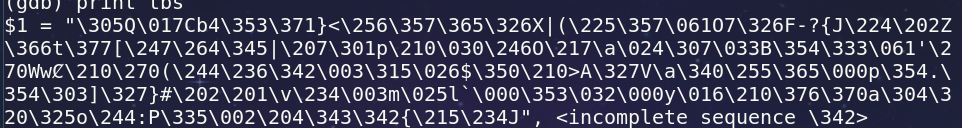
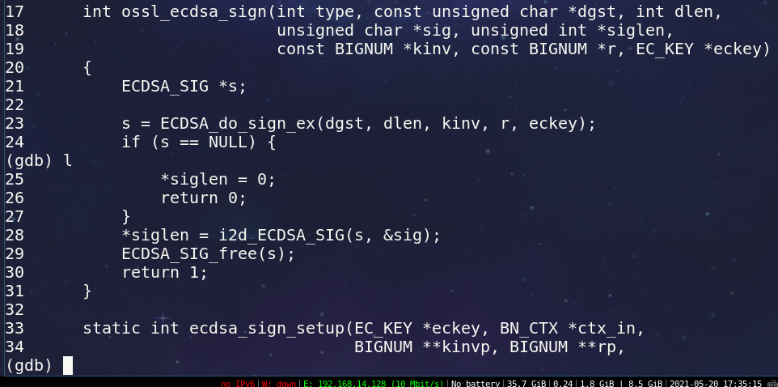
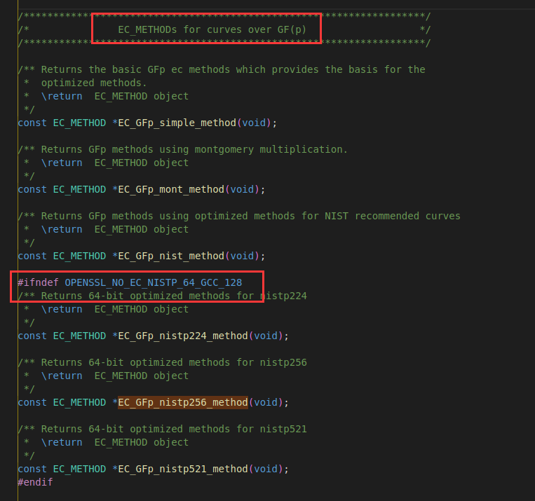
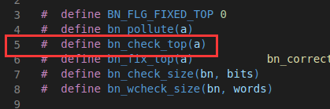
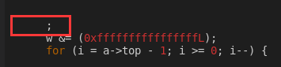

## 1 代码结构

调用关系

 `EVP_DigestSign` -> `EVP_DigestSignFinal` -> `EVP_PKEY_sign` -> `pkey_ec_sign` -> `ECDSA_sign`

`i2d_ECDSA_SIG` 将签名编码

`ossl_ecdsa_sign_sig` 函数实现签名

## 1 openssl 中 ecdsa 的 nistz256 调试记录

1. 利用 nid 生成密钥，其中最高优化的 nistp256 曲线的 nid 为 19 (起始是 0)
2. 重新编译 openssl 库，因为我添加了 no-asm 参数，这会阻碍 nistp256 很多汇编形式的优化

### 1.1 完成微架构层面的优化

两个重要内容的位置：

1. `ecp_nistz256_points_mul at crypto/ec/ecp_nistz256.c:1063`

2. `crypto/ec/ecp_nistz256.c:75` 列举除了一些基本的底层函数，这些函数都是为了优化 nistp256 曲线而特意编写的，并且都是汇编实现，具体实现是在文件 `/home/tam/Documents/openssl-OpenSSL_1_1_1-stable/crypto/ec/ecp_nistz256-x86_64.s`  

ecp_nistz256_point_add_affine 这个函数在 `nistp256` 曲线下也是汇编实现的，这个应该是点乘函数的主体

## 1 OpenSSL 之 speed 子命令解析

### 1.1 找寻 `speed` 子命令究竟能用哪些选项

官方文档并没有列出详细选项，但是你可以通过查看源代码的方式找到所有的选项

比如 `openssl speed ecdsap256` 中的选项 `ecdsap256` 可以使用 `ag ecdsap256` 在 `openssl-OpenSSL_1_1_1-stable/apps/speed.c : 526`, 这个选项以一个数组的形式存储。

## 3 openssl版本支持日期

下面是，OpenSSL官方公告，指出 1.1.1 系列会支持到 2023 年

*Note:* The latest stable version is the 1.1.1 series. This is also our Long Term Support (LTS) version, supported until 11th September 2023. All older versions (including 1.1.0, 1.0.2, 1.0.0 and 0.9.8) are now out of support and should not be used. <https://www.openssl.org/source/>

## 2 椭圆曲线操作相关代码

### 2.1 点加运算代码分析

```c
int ec_GFp_simple_add(const EC_GROUP *group, EC_POINT *r, const EC_POINT *a,
                 const EC_POINT *b, BN_CTX *ctx)
{
   int (*field_mul) (const EC_GROUP *, BIGNUM *, const BIGNUM *,
                 const BIGNUM *, BN_CTX *);
   int (*field_sqr) (const EC_GROUP *, BIGNUM *, const BIGNUM *, BN_CTX *);
   const BIGNUM *p;
   BN_CTX *new_ctx = NULL;
   BIGNUM *n0, *n1, *n2, *n3, *n4, *n5, *n6;
   int ret = 0;

   if (a == b)
      return EC_POINT_dbl(group, r, a, ctx);
   if (EC_POINT_is_at_infinity(group, a))
      return EC_POINT_copy(r, b);
   if (EC_POINT_is_at_infinity(group, b))
      return EC_POINT_copy(r, a);

   field_mul = group->meth->field_mul;
   field_sqr = group->meth->field_sqr;
   p = group->field;

   if (ctx == NULL) {
      ctx = new_ctx = BN_CTX_new();
      if (ctx == NULL)
         return 0;
   }

   BN_CTX_start(ctx);
   n0 = BN_CTX_get(ctx);
   n1 = BN_CTX_get(ctx);
   n2 = BN_CTX_get(ctx);
   n3 = BN_CTX_get(ctx);
   n4 = BN_CTX_get(ctx);
   n5 = BN_CTX_get(ctx);
   n6 = BN_CTX_get(ctx);
   if (n6 == NULL)
      goto end;

   /*
    * Note that in this function we must not read components of 'a' or 'b'
    * once we have written the corresponding components of 'r'. ('r' might
    * be one of 'a' or 'b'.)
    */

   /* n1, n2 */
   if (b->Z_is_one) {
      if (!BN_copy(n1, a->X))
         goto end;
      if (!BN_copy(n2, a->Y))
         goto end;
      /* n1 = X_a */
      /* n2 = Y_a */
   } else {
      if (!field_sqr(group, n0, b->Z, ctx))
         goto end;
      if (!field_mul(group, n1, a->X, n0, ctx))
         goto end;
      /* n1 = X_a * Z_b^2 */

      if (!field_mul(group, n0, n0, b->Z, ctx))
         goto end;
      if (!field_mul(group, n2, a->Y, n0, ctx))
         goto end;
      /* n2 = Y_a * Z_b^3 */
   }

   /* n3, n4 */
   if (a->Z_is_one) {
      if (!BN_copy(n3, b->X))
         goto end;
      if (!BN_copy(n4, b->Y))
         goto end;
      /* n3 = X_b */
      /* n4 = Y_b */
   } else {
      if (!field_sqr(group, n0, a->Z, ctx))
         goto end;
      if (!field_mul(group, n3, b->X, n0, ctx))
         goto end;
      /* n3 = X_b * Z_a^2 */

      if (!field_mul(group, n0, n0, a->Z, ctx))
         goto end;
      if (!field_mul(group, n4, b->Y, n0, ctx))
         goto end;
      /* n4 = Y_b * Z_a^3 */
   }

   /* n5, n6 */
   if (!BN_mod_sub_quick(n5, n1, n3, p))
      goto end;
   if (!BN_mod_sub_quick(n6, n2, n4, p))
      goto end;
   /* n5 = n1 - n3 */
   /* n6 = n2 - n4 */

   if (BN_is_zero(n5)) {
      if (BN_is_zero(n6)) {
         /* a is the same point as b */
         BN_CTX_end(ctx);
         ret = EC_POINT_dbl(group, r, a, ctx);
         ctx = NULL;
         goto end;
      } else {
         /* a is the inverse of b */
         BN_zero(r->Z);
         r->Z_is_one = 0;
         ret = 1;
         goto end;
      }
   }

   /* 'n7', 'n8' */
   if (!BN_mod_add_quick(n1, n1, n3, p))
      goto end;
   if (!BN_mod_add_quick(n2, n2, n4, p))
      goto end;
   /* 'n7' = n1 + n3 */
   /* 'n8' = n2 + n4 */

   /* Z_r */
   if (a->Z_is_one && b->Z_is_one) {
      if (!BN_copy(r->Z, n5))
         goto end;
   } else {
      if (a->Z_is_one) {
         if (!BN_copy(n0, b->Z))
            goto end;
      } else if (b->Z_is_one) {
         if (!BN_copy(n0, a->Z))
            goto end;
      } else {
         if (!field_mul(group, n0, a->Z, b->Z, ctx))
            goto end;
      }
      if (!field_mul(group, r->Z, n0, n5, ctx))
         goto end;
   }
   r->Z_is_one = 0;
   /* Z_r = Z_a * Z_b * n5 */

   /* X_r */
   if (!field_sqr(group, n0, n6, ctx))
      goto end;
   if (!field_sqr(group, n4, n5, ctx))
      goto end;
   if (!field_mul(group, n3, n1, n4, ctx))
      goto end;
   if (!BN_mod_sub_quick(r->X, n0, n3, p))
      goto end;
   /* X_r = n6^2 - n5^2 * 'n7' */

   /* 'n9' */
   if (!BN_mod_lshift1_quick(n0, r->X, p))
      goto end;
   if (!BN_mod_sub_quick(n0, n3, n0, p))
      goto end;
   /* n9 = n5^2 * 'n7' - 2 * X_r */

   /* Y_r */
   if (!field_mul(group, n0, n0, n6, ctx))
      goto end;
   if (!field_mul(group, n5, n4, n5, ctx))
      goto end;               /* now n5 is n5^3 */
   if (!field_mul(group, n1, n2, n5, ctx))
      goto end;
   if (!BN_mod_sub_quick(n0, n0, n1, p))
      goto end;
   if (BN_is_odd(n0))
      if (!BN_add(n0, n0, p))
         goto end;
   /* now  0 <= n0 < 2*p,  and n0 is even */
   if (!BN_rshift1(r->Y, n0))
      goto end;
   /* Y_r = (n6 * 'n9' - 'n8' * 'n5^3') / 2 */

   ret = 1;

 end:
   BN_CTX_end(ctx);
   BN_CTX_free(new_ctx);
   return ret;
}
```

可以看到 line 21 的 `p = group->field;` 可见点加是模 p 运算而不是模 n 运算。

### 2.2 蒙哥马利辅助变量

点群结构体中有一个辅助变量叫做 `mont_data` 他是一个蒙哥马利辅助变量，椭圆曲线中是通过 `order` 这个变量初始化它的，`mont_data` 中包含一个成员变量 `RR` ，这个变量就是转成蒙哥马利形式需要乘上的数。这个变量本来是 2^n^ ，但是初始化 `mont_data` 的 `BN_MONT_CTX_set` 还有额外一步，那就是将 `RR` 的值取 `order` 的模，这样它就不再是 2 的整数次幂了，所以以后在调试时看到它的值比较奇怪也不要惊讶。

初始化 `mont_data` 的函数 `BN_MONT_CTX_set`  在 `~/Documents/openssl-OpenSSL_1_1_1-stable/crypto/bn/bn_mont.c : 263`

### 2.3 各种结构体和曲线参数

各种种类的椭圆曲线参数在文件 `ec_curve.c` 中，而结构体 `ec_method_st` , `ec_group_st` , `ec_key_st` , `ec_point_st` ，等一些结构体在文件 `ec_local.h` ，这两个文件都在目录 `~/Documents/openssl-OpenSSL_1_1_1-stable/crypto/ec` 下。

# 20210521

## OpenSSL 关于 ECDSA 函数的使用

### 较底层的 ECDSA 算法函数

1. `ECDSA_SIG *ossl_ecdsa_sign_sig(const unsigned char *dgst, int dgst_len,
                          const BIGNUM *in_kinv, const BIGNUM *in_r,
                          EC_KEY *eckey)`

   作用：对摘要进行签名
   输入：摘要 dgst, 摘要长度 dgst_len, EC_KEY * 类型的密钥 eckey
   输出：in_kinv, in_r，返回值 dgst 的签名值 (r, s)
   返回值：dgst 的签名值 (r, s)

2. `ossl_ecdsa_verify` 调用 `d2i_ECDSA_SIG` 和 `ECDSA_do_verify` , `ECDSA_do_verify` 调用 `ossl_ecdsa_verify_sig`

3. `int ossl_ecdsa_verify_sig(const unsigned char *dgst, int dgst_len,const ECDSA_SIG *sig, EC_KEY *eckey)`

   作用：对签名进行验签
   输入：摘要 `dgst`, 摘要长度 `dgst_len`, EC_KEY *类型的密钥 `eckey`，ECDSA_SIG* 类型的 sig
   输出：ret (表示是否成功)，1代表成功，0代表失败
   返回值：ret (表示是否成功)，1代表成功，0代表失败

## 1 OpenSSL 中的 ECDSA 调试

### 1.1 程序位置

调试程序的目录在 `/home/tam/shares/win10-share/编程linux二进制imp/Openssl学习/day03_ecdsatest源码学习` 下，其中含有 `makefile` 文件，是一个书写 `makefile` 的参考。



```c
ossl_ecdsa_verify_sig (
   dgst=0x7fffffffe190 "M\217\260\214\275BO\036\350\233c|\343\340p\202\206\f\270\265\320}\257S\267}z\327\001饻\340\341\377\377\377\177", dgst_len=32,
   sig=0x555555614990, eckey=0x555555611bd0) at crypto/ec/ecdsa_ossl.c:320
```



底层函数 `ECDSA_do_sign_ex` 等它调用的一系列函数共同产生的结果，结果中主要是一个签名结果即 `ECDSA_SIG*` 类型的 `s`，然后调用 `ECDSA_do_sign_ex` 函数的 `ossl_ecdsa_sign` 将 `ECDSA_SIG*` 类型的 `s` 使用 `i2d_ECDSA_SIG` 函数，将其编码为 `char*`  类型的 `sig`

```c
int ossl_ecdsa_sign(int type, const unsigned char *dgst, int dlen,
               unsigned char *sig, unsigned int *siglen,
               const BIGNUM *kinv, const BIGNUM *r, EC_KEY *eckey)
{
   ECDSA_SIG *s;

   s = ECDSA_do_sign_ex(dgst, dlen, kinv, r, eckey);
   if (s == NULL) {
      *siglen = 0;
      return 0;
   }
   *siglen = i2d_ECDSA_SIG(s, &sig);
   ECDSA_SIG_free(s);
   return 1;
}
```

然后 `ECDSA_do_sign_ex` 调用了 `ossl_cdsa_sign_sig` 函数，该函数信息如下：

``` c
ossl_ecdsa_sign_sig (
   dgst=0x7fffffffe200 "9t\277\225\252}\333\346c\211\331\352PD\333ѿζȸ\214.բO\343\203l\323\066OP\342\377\377\377\177", dgst_len=32, in_kinv=0x0, in_r=0x0,
   eckey=0x555555610c20) at crypto/ec/ecdsa_ossl.c:157
```

前面说到 `ECDSA_SIG*` 类型的签名结果会通过 `i2d_ECDSA_SIG(s, &sig)` 函数转成字符串 `sig` ，这个函数还会返回 `sig` 的长度 `siglen`

```c
struct ECDSA_SIG_st {
   BIGNUM *r;
   BIGNUM *s;
}
```

签名中真正干了实事的是函数 `ossl_cdsa_sign_sig` ，参数有 `const unsigned char *dgst` 和 `int dgst_len` ，一个存储了之前的消息被哈希后的摘要，`dgst_len` 存放了摘要所占字节数，该值为 32 ，说明是 `sha256` 。该函数的详细实现如下：

```c
ECDSA_SIG *ossl_ecdsa_sign_sig(const unsigned char *dgst, int dgst_len,
                        const BIGNUM *in_kinv, const BIGNUM *in_r,
                        EC_KEY *eckey)
{
   int ok = 0, i;
   BIGNUM *kinv = NULL, *s, *m = NULL;
   const BIGNUM *order, *ckinv;
   BN_CTX *ctx = NULL;
   const EC_GROUP *group;
   ECDSA_SIG *ret;
   const BIGNUM *priv_key;

   group = EC_KEY_get0_group(eckey);
   priv_key = EC_KEY_get0_private_key(eckey);

   if (group == NULL) {
      ECerr(EC_F_OSSL_ECDSA_SIGN_SIG, ERR_R_PASSED_NULL_PARAMETER);
      return NULL;
   }
   if (priv_key == NULL) {
      ECerr(EC_F_OSSL_ECDSA_SIGN_SIG, EC_R_MISSING_PRIVATE_KEY);
      return NULL;
   }

   if (!EC_KEY_can_sign(eckey)) {
      ECerr(EC_F_OSSL_ECDSA_SIGN_SIG, EC_R_CURVE_DOES_NOT_SUPPORT_SIGNING);
      return NULL;
   }

   ret = ECDSA_SIG_new();
   if (ret == NULL) {
      ECerr(EC_F_OSSL_ECDSA_SIGN_SIG, ERR_R_MALLOC_FAILURE);
      return NULL;
   }
   ret->r = BN_new();
   ret->s = BN_new();
   if (ret->r == NULL || ret->s == NULL) {
      ECerr(EC_F_OSSL_ECDSA_SIGN_SIG, ERR_R_MALLOC_FAILURE);
      goto err;
   }
   s = ret->s;

   if ((ctx = BN_CTX_new()) == NULL
      || (m = BN_new()) == NULL) {
      ECerr(EC_F_OSSL_ECDSA_SIGN_SIG, ERR_R_MALLOC_FAILURE);
      goto err;
   }

   order = EC_GROUP_get0_order(group);
   i = BN_num_bits(order);
   /*
    * Need to truncate digest if it is too long: first truncate whole bytes.
    */
   if (8 * dgst_len > i)
      dgst_len = (i + 7) / 8;
   // 这一步将字符型转成大整数型
   if (!BN_bin2bn(dgst, dgst_len, m)) {
      ECerr(EC_F_OSSL_ECDSA_SIGN_SIG, ERR_R_BN_LIB);
      goto err;
   }
   /* If still too long, truncate remaining bits with a shift */
   if ((8 * dgst_len > i) && !BN_rshift(m, m, 8 - (i & 0x7))) {
      ECerr(EC_F_OSSL_ECDSA_SIGN_SIG, ERR_R_BN_LIB);
      goto err;
   }
   do {
      if (in_kinv == NULL || in_r == NULL) {
         if (!ecdsa_sign_setup(eckey, ctx, &kinv, &ret->r, dgst, dgst_len)) {
            ECerr(EC_F_OSSL_ECDSA_SIGN_SIG, ERR_R_ECDSA_LIB);
            goto err;
         }
         ckinv = kinv;
      } else {
         ckinv = in_kinv;
         if (BN_copy(ret->r, in_r) == NULL) {
            ECerr(EC_F_OSSL_ECDSA_SIGN_SIG, ERR_R_MALLOC_FAILURE);
            goto err;
         }
      }

      /*
       * With only one multiplicant being in Montgomery domain
       * multiplication yields real result without post-conversion.
       * Also note that all operations but last are performed with
       * zero-padded vectors. Last operation, BN_mod_mul_montgomery
       * below, returns user-visible value with removed zero padding.
       */
      if (!bn_to_mont_fixed_top(s, ret->r, group->mont_data, ctx)
         || !bn_mul_mont_fixed_top(s, s, priv_key, group->mont_data, ctx)) {
         ECerr(EC_F_OSSL_ECDSA_SIGN_SIG, ERR_R_BN_LIB);
         goto err;
      }
      if (!bn_mod_add_fixed_top(s, s, m, order)) {
         ECerr(EC_F_OSSL_ECDSA_SIGN_SIG, ERR_R_BN_LIB);
         goto err;
      }
      /*
       * |s| can still be larger than modulus, because |m| can be. In
       * such case we count on Montgomery reduction to tie it up.
       */
      if (!bn_to_mont_fixed_top(s, s, group->mont_data, ctx)
         || !BN_mod_mul_montgomery(s, s, ckinv, group->mont_data, ctx)) {
         ECerr(EC_F_OSSL_ECDSA_SIGN_SIG, ERR_R_BN_LIB);
         goto err;
      }

      if (BN_is_zero(s)) {
         /*
          * if kinv and r have been supplied by the caller, don't
          * generate new kinv and r values
          */
         if (in_kinv != NULL && in_r != NULL) {
            ECerr(EC_F_OSSL_ECDSA_SIGN_SIG, EC_R_NEED_NEW_SETUP_VALUES);
            goto err;
         }
      } else {
         /* s != 0 => we have a valid signature */
         break;
      }
   } while (1);

   ok = 1;
 err:
   if (!ok) {
      ECDSA_SIG_free(ret);
      ret = NULL;
   }
   BN_CTX_free(ctx);
   BN_clear_free(m);
   BN_clear_free(kinv);
   return ret;
}
```

`ecdsa_sign_setup` 函数的作用是计算 k*G，还有 `k` 的逆，信息摘要 `dgst` 这个传入参数没有被这个函数用到。顾名思义，这个函数就是将 ECDSA 签名所需要的参数都给计算出来，即 setup，安装之意。它被函数 `ossl_ecdsa_sign_sig` 所调用，`ossl_ecdsa_sign_sig` 执行了ECDSA算法的所有过程，而 `ecdsa_sign_setup` 只是计算了部分需要的参数，具体 `ECDSA` 算法详解可以查看 CSDN 的资料 [签名原理](https://blog.csdn.net/samsho2/article/details/90581118)

### 1.2 整体过程

对于 `ecdsatest.c` 文件中的 ECDSA 算法的签名过程，前面的都略过，只看 `ECDSA_sign` 往后的调用，这之前的 `backtrace` 关系为 `EVP_DigestSign` -> `EVP_DigestSignFinal` -> `EVP_PKEY_sign` -> `pkey_ec_sign` -> `ECDSA_sign`，之所以从 `ECDSA_sign` 开始看，是因为从这里开始，资料 [CSDN介绍OpenSSL签名函数调用关系](https://blog.csdn.net/samsho2/article/details/90581207) 就开始详细介绍后面函数的作用及调用关系，虽然一些函数名字不太一样，但是提到的功能在我这个版本都有的，其中重要的是 `i2d_ECDSA_SIG` ，它将得到的签名编码成一个字符串。在这个编码之前，是对摘要的签名，主要是 `ossl_ecdsa_sign_sig` 函数实现签名的所有功能，其中它调用了一个名为 `ecdsa_sign_setup` 的函数计算一些需要的参数。

字符串`"i love you,love you"`，对应的 `SHA256` 的摘要值为：

```c
(gdb) x /32xb 0x7fffffffe200
0x7fffffffe200: 0x39 0x74 0xbf 0x95 0xaa 0x7d 0xdb 0xe6
0x7fffffffe208: 0x63 0x89 0xd9 0xea 0x50 0x44 0xdb 0xd1
0x7fffffffe210: 0xbf 0xce 0xb6 0xc8 0xb8 0x8c 0x2e 0xd5
0x7fffffffe218: 0xa2 0x4f 0xe3 0x83 0x6c 0xd3 0x36 0x4f
```

我运行了两次程序，然后以上面同样的查看了字符串 `"i love you,love you"` 的 `SHA256` 的摘要值，结果表明是相同的。

我这个版本的 OpenSSL 的从 `ECDSA_sign` 函数以后的调用关系如下：

`ECDSA_sign` ->(完全只是调用了ECDSA_sign_ex，没有其他代码) `ECDSA_sign_ex` () -> (也只是单纯调用，没有其他代码) `ossl_ecdsa_sign` -> (在调用下一个函数后，对这个函数返回的签名进行了编码，使用了 `i2d_ECDSA_SIG` 这个函数) `ECDSA_do_sign_ex` -> (完全没其他代码，只是调用) `ossl_ecdsa_sign_sig`

最后的 `ossl_ecdsa_sign_sig` 还调用了其他，我就不说了，因为这个还是真正做实事的函数，它调用了一个函数进行 k*G 和 k 逆等一切必要参数的计算。

### 1.3 接下来的工作

除去这么长的调用链，自己改写代码写一个简洁的 ECDSA 程序，这需要研究 `eckey` 的结构，各种类型的临时变量。

## 4 测试需要的文件

### 4.1  传统方法

传统三类 nist, mont, simple 效率不高 (不分先后)，点乘层面都是用了 wNAF 来表示标量一定程度减少了点加和倍加；椭圆曲线的点运算层面使用**什么坐标未知**；域运算层面分别使用 nist mont simple 法来适应，对应了这三个方法的名字。至于**最底层的大数实现，不是很清楚**，看到三种传统方法层与层之间的分界很严格，完全透明。

### 4.2 稍微特殊的方法

各个层面的联系更加紧密了，比如模乘运算和大数层面的实现糅合到了一起[11年论文]，结果就是1个模乘运算需要16个64bit到128bit的乘法和9个128bit的加法；模平方所需的更少。其实除了这些主要的乘法，模乘还需要一些线性运算，常数乘法和加法；使用左边加若干模的方法使得制作无符号减法。最后还要考虑每个元素在乘法过后的溢出问题。

[11年论文]在椭圆曲线点操作层面要比白野说的 COZ-J 需要的主要操作：即模乘，模平方还要少。即 5S + 3M，稍微多了一些开销较小的运算而已，12次的线性运算(线性运算包括，加法，减法，常数乘法)

分析了点加和倍点的计算链，用到了如下方法来尽可能减少溢出：

1. x^2^ - y^2^ 肯定在运算过程中溢出，于是我们使用
2. ...

点乘层面分固定和非固定点乘：

1. 固定可以有预计算表
2. 非固定只能使用动态预计算表(交错相乘，batch 乘法)

## 2 参考资料

1. BN_hex2bin 挺好用的，参考 test 文件中的代码

   <http://hyperelliptic.org/EFD/g1p/auto-shortw-jacobian-3.html#addition-add-2007-bl>

   这个链接是在 /home/tam/Desktop/t1/openssl/crypto/ec/ecp_nistp256.c 中发现的

2. 雅可比和仿射混合加速点乘

   Double-and-Add with Relative Jacobian Coordinates

## 3 i/ECDSA 不同的实现方法

点加和倍点由域运算实现，所以点加和倍点可以分解成若干个域乘和域加，域平方，域逆；域逆几乎不会用到就先不考虑，连接这两层的桥梁是坐标的选择；选择的结果导致模乘、模平方、模加操作的减少。

模运算又要被分解为大数运算；openssl中三个普通的曲线方法，nist、simple、montgomery的模乘和模平方对应着不同的实现，结果是大数运算的量不同。最后剩下一个模加，这就有点名堂了。nist的模乘和模平方的取模运算的在文件 ecp_nist.c中的ec_GFp_nist_group_set_curve函数上，是 group结构体中的一个成员函数。其他两种的这个成员函数的定义应该也在分别对应的文件中，但结果发现这两种无field_mod_func函数

mod_add 都是用了 bn_mod_add_fixed_top，在 bn_mod.c 文件中

更好观察它们，可以使用 EC_GROUP *EC_GROUP_new(const EC_METHOD*meth); 这个函数，在ec.h中

## 5 group 中 method 声明

at crypto/ec/ec.h

1.0.1f 版本



6 种方法，前三种没有自己的点乘算法，使用的都是 wNAF 算法，后面三个实现了特殊的点乘算法

0.9.8 版本仅有三种方法

较新版本的 openssl 在 include/openssl 目录下，ec.h，还是 6 种

## 4 ecc.h 中的函数说明

size_t EC_get_builtin_curves(EC_builtin_curve *r, size_t nitems);

用法：

```c
crv_len = EC_get_builtin_curves(NULL,0);
curves = OPENSSL_malloc(sizeof(*curves) * crv_len);
EC_get_builtin_curves(curves,crv_len);
```

EC_GROUP *EC_GROUP_new_by_curve_name(int nid);

EC_KEY *EC_KEY_new_by_curve_name(int nid);

用法：

```c
eckey = EC_KEY_new_by_curve_name(nid);
EC_KEY_generate_key(eckey);
```

 nid = curves[19].nid;

const char *EC_curve_nid2nist(int nid);

int EC_curve_nist2nid(const char *name);

openssl 0.9.8

```c
static ECDSA_SIG *ecdsa_do_sign(const unsigned char *dgst, int dgst_len, 
  const BIGNUM *in_kinv, const BIGNUM *in_r, EC_KEY *eckey) //@ecdsa:ecs_ossl.c

static int ecdsa_sign_setup(EC_KEY *eckey, BN_CTX *ctx_in, BIGNUM **kinvp,
  BIGNUM **rp //同上
EC_POINTs_mul at ec_lib.c:1120
                     

//方法 at ec.h
const EC_METHOD *EC_GFp_simple_method(void);
const EC_METHOD *EC_GFp_mont_method(void);
const EC_METHOD *EC_GFp_nist_method(void)
```

EC_GROUP_new_curve_GFp(p, a, b, NULL) 即可创建，调用的是 EC_GFp_mont_method

# 20210710

## 1 assert 断言函数

参考 <http://c.biancheng.net/c/assert/>

**也就是说，如果表达式 expression 的值为假（即为 0），那么它将首先向标准错误流 stderr 打印一条出错信息**，然后再通过调用 abort 函数终止程序运行；否则，

## 2 gcc -E 查看宏展开

利用宏展开



上面的那个脑残宏，宏展开是空的：



真傻逼

命令：

`tam@ubuntu:~/Desktop/t1/openssl/crypto/bn$`

`gcc -E -o Ebn_word.c bn_word.c -I /home/tam/Desktop/t1/openssl/include`

## 3 其他

1. 模运算

BN_nist_mod_256 @ BN_nist_mod_func @ openssl/crypto/bn/bn_nist.c

## 未完成

1. BNerr @ BN_usub @ bn_add.c 这个函数是啥玩意儿

## c语言

### char 类型打印出大于 8 bit 的数

char类型数据在计算机中存的是补码,占一个字节
可我在电脑上s[i]输出是ffffffe7啊
这是因为你没有屏蔽高位，你这样输出：
printf("%x", ch &0xff ) ; //ch占一个字节，但按%x输出，系统是当成一个整数来输出的，所以负数的高位全是1，呈现为ffffff
**还可以指定 unsigned char 来解决这个问题**

## 结构体

### typedef struct bignum_st BIGNUM

```c
struct big 2x`num_st {
   BN_ULONG *d;                /* Pointer to an array of 'BN_BITS2' bit
                         * chunks. */
   int top;                    /* Index of last used d +1. */
   /* The next are internal book keeping for bn_expand. */
   int dmax;                   /* Size of the d array. */
   int neg;                    /* one if the number is negative */
   int flags;
};
```

1. dmax 一般和 top一样大，top <= dmax，因为 d 数组的元素可能没有完全被用，有一些没有被使用的元素，应该 d[0] 存储的是低 64 位

2. flags 不知道，但是有个例子

   ```c
   static const BIGNUM _bignum_nist_p_256 = {
      (BN_ULONG *)_nist_p_256[0],
      BN_NIST_256_TOP,
      BN_NIST_256_TOP,
      0,
      BN_FLG_STATIC_DATA
   };
   /*
   flags：BN_FLG_STATIC_DATA
   #define BN_FLG_STATIC_DATA 0x02
   */
   ```

## 参考资料

r <https://neuromancer.sk/std/nist/> ki 椭圆曲线参数的数据参考网很实用！

r <http://hyperelliptic.org/EFD/g1p/auto-shortw-jacobian-3.html#addition-add-2007-bl> k1 add-2007-bl ki 不同坐标不同算法点加实现的开销

r `G:\desktop\dk-win\20210713\2021年4月\20210516-爬虫.md`

r `G:\desktop\dk-win\20210713\my密码库实现\我的密码库.md`
