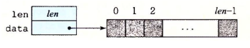
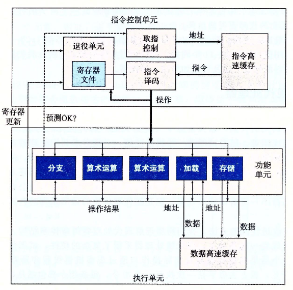
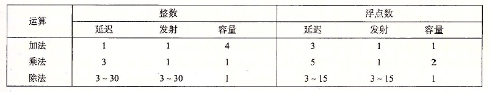
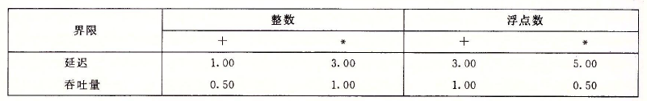
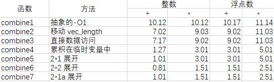

以下内容来源于csapp书上，随书配套代码的下载，可以参考：<http://csapp.cs.cmu.edu/3e/code.html>

## 1 软件优化

软件优化可以分为三个层面：

1. 软件层面的优化
2. 体系结构层面的优化
3. 微体系结构层面的优化

软件层面的优化的优化对象是那些决定程序运行时间的软件操作。比如ECDSA签名算法中占大部分运行时间的是点乘操作，点乘操作由点加操作组成，从软件层面优化该算法就可以以减少点加操作的次数来达到优化目的。

体系结构层面的优化不依赖于目标机器的任何具体属性，研究的范围是程序员所有可见的东西，最底层为汇编代码。在该层面影响性能的属性有内存引用次数过多和寄存器使用不当。

微体系结构层面的优化需要了解处理器是如何设计的(例如处理器功能单元的结构)，采用了哪些技术(例如寄存器重命名、分支预测、乱序执行技术)。通过对目标机器的微体系结构的理解，对代码进行修改使其更适应处理器的各种特性，这样就能进一步提高性能。

### 1.1 编译器优化

编译器主要是进行体系结构层面的优化，有些时候也会间接影响微体系结构层面的优化(比如通过循环展开可以达到一个指令的延迟界限)。所以高层设计(软件层面)和微体系结构层面的优化主要由编程人员自行设计和修改代码。除此之外编译器还会受妨碍优化的因素的影响，在体系结构层面的优化也不能达到预期的效果，程序员必须编写出容易被编译器优化的代码

#### 内存引用

一个减少内存引用层数的例子如下：

```c
for (int i =0;i<length;i++){
   sum=sum * data[i]
}
```

该代码计算数组元素的乘积，使用命令`gcc test.c -S`产生上面循环的对应汇编代码：

```asm
.L3:
 movl -104(%rbp), %eax
 cltq
 movl -96(%rbp,%rax,4), %eax
 movl -108(%rbp), %edx
 imull %edx, %eax
 movl %eax, -108(%rbp)
 addl $1, -104(%rbp)
.L2:
 movl -104(%rbp), %eax
 cmpl -100(%rbp), %eax
 jl .L3
```

上面使用了四个内存地址：-104(%rbp)表示变量i，-100(%rbp)表示变量length，-96(%rbp,%rax,4)表示数组元素data[i]，-108(%rbp)表示变量sum。未使用优化选项生成的这段循环代码的汇编代码，一个循环使用了7次内存引用：5次内存读和2次内存写。

可以看到上面的汇编代码的第10行和第2行的汇编指令是冗余的，完全可将第2行删除，而-100(%rbp)中存放length，每进行一次循环它都会与变量i(相应内存引用为-104(%rbp))进行比较，进而产生两次内存引用即第10行和第11行，我们可以实现将这两个变量存入寄存器，这样每次比较只是通过寄存器比较，减少了2次内存引用，提升了性能，因为内存读写操作要比寄存器操作更费时。通过上面的分析，将汇编代码修改后就能够将原来的7次内存引用降至4次内存引用。

#### 寄存器的使用

一个合理使用寄存器的例子如下：

```c
int sum_simple(int* vec)
{
   int res = 0;
   int i;
   for (i = 0; i < 500; ++i) {
      res += vec[i];
   }
   return res;
}
```

函数的主要功能是数组元素的累加，使用gcc的`-O1`优化选项得到循环操作的汇编代码如下：

```asm
 leaq 2000(%rdi), %rdx
 movl $0, %eax
.L2:
 addl (%rdi), %eax
 addq $4, %rdi
 cmpq %rdx, %rdi
 jne .L2
```

可以看到一次循环只会取一个元素进行加操作。为了优化，我们可以使用gcc编译器的`-O3`优化选项进一步优化，得到如下的汇编代码：

```asm
 movdqu (%rdi), %xmm2
 addq $16, %rdi
 paddd %xmm2, %xmm0
 cmpq %rdi, %rax
 jne .L2
```

可以看到这次循环代码对应的汇编代码使用了xmm寄存器，该寄存器可以同时执行4次32位的整数操作，`movdqu (%rdi), %xmm2`将内存中的4个32位整数放入xmm2寄存器，然后 `paddd %xmm2, %xmm0`指令用来完成每次循环的累加，每次累加是4个32位整数同时进行。

上面的两个例子表明，通过减少内存引用操作和合理使用寄存器可以提升程序的性能，这些都通过开启编译器的相关优化选项来完成。编译器目的就是为了减少不必要的函数调用、条件测试和内存引用，这就是体系结构层面的性能优化所要考虑的因素，因为他们不依赖于目标及其的任何具体属性。然而编译器也有局限性，即使是最好的编译器也受到**妨碍优化的因素**(optimization blocker)的阻碍，妨碍优化的因素就是程序行为中哪些严重依赖于执行环境的方面。程序员必须编写出容易优化的代码，来帮助编译器生成更高效的机器代码。

所以体系结构层面的优化可以有下面两个方面可以考虑优化：

1. 编译器能够优化的部分
2. 编译器未能优化的部分

编译器有很多优化方法：代码移动、减少过程调动(函数调用)、内联替换(用来消除函数调用的开销)、循环展开(减少循环开销)、使用SIMD指令、消除不必要的内存引用等。简单地使用编译器就可以使得C代码获得极大的性能提升。但是编译器必须很小心地对程序只使用安全的优化，也就是说对应程序可能遇到的所有可能的情况，在C语言标准提供的保证下，优化后得到的程序和未优化的版本有一样的行为。限制编译器只进行安全的优化，消除了造成不希望的运行时行为的一些可能的原因，但是这也意味着程序员必须花费更大的力气写出编译器能够将之转换成有效及机器代码的程序，这就是优化中我们需要考虑的第二个方面，编译器未能优化的部分。

现在来讨论不能使编译器优化原本可以优化的妨碍优化因素：

1. 内存别名使用
2. 函数调用

上面两个因素会导致编译器的优化能力受限。

#### 内存别名使用

两个指针可能指向同一个内存位置的情况称为内存别名使用(memory aliasing)

来看看下面的这两个过程：

```c
void twiddle1(long *xp, long *yp){
 *xp += *yp;
 *xp += *yp;
}
```

```c
void twiddle2(long *xp, long *yp){
 *xp += 2* *yp;
 *xp += *yp;
}
```

通过简单的观察发现这两个函数(过程)似乎有相同的行为。它们都是将存储在由指针yp指示的位置处的值两次加到指针xp指示的位置处的值。另一方面，函数twiddle2效率更高一些。因为它只有3次内存引用(读\*xp, 读\*yp，写\*xp)，然而twiddle1需要6次(2次读\*xp，2次读\*yp，两次写\*xp)。twiddle1函数应该被优化成twiddle2函数这样的形式，但是编译器并不会这样做，原因如下：

考虑xp等于yp的情况，此时函数twiddle1会执行下面的计算

```c
*xp += *xp
*xp += *xp
```

结果是xp的值增加4倍，另一方面，函数twiddle2会执行下面的计算：

`*xp +=2* *xp`

结果是xp的值增加3倍，编译器不知道twiddle1会如何被调用，因此它必须假设参数xp和yp可能会相等。因此，编译器不知道twiddle1会如何被调用，因此它必须假设参数xp和yp可能会相等。因此，它不能产生twiddle2风格的代码作为twiddle1的优化版本。

#### 函数调用

第二个妨碍优化的因素是函数调用。作为一个示例，考虑下面这两个过程：

```c
long f();
long func1(){
   return f()+f()+f()+f();
}
long func2(){
   return 4*f();
}
```

最初看上去两个过程计算的都是相同的结果，但是func2只调用f一次，而func1调用四次。以func1作为源代码时，编译器若是能产生fun2风格的代码就能明显提高性能。

不过考虑下面f的代码：

```c
long counter=0;
long f(){
   return counter++;
}
```

这个函数有个副作用，它修改了全局程序状态的一部分。改变调用它的次数会改变程序的行为。特别地，假设开始时全局变量counter都设置为0，对func1的调用会返回0+1+2+3=6，而对fun2的调用会返回4\*0=0。

大多数编译器不会试图判断一个有没有副作用，如果一个func1没有上面提到的这个副作用，那么它就可能被优化成func2风格的代码。但是编译器会假设最糟糕的情况，并保持所有的函数调用不变。

以上对于编译器未能优化的情况，我们可以人为地进行分析和优化：

例如，针对上面的函数func1()，它是一个包含函数调用的代码，这种代码可以通过内联函数替换的方法替换掉对函数调用，优化后的代码如下：

```c
long function(){
   long t =counter++;
   t += counter++;
   t += counter++;
   t += counter++;
   return t;
}
```

这样的转换既减少了函数调用的开销，也允许对展开的代码做进一步优化。例如编译器可以统一function中对全局变量counter的更新，产生这个函数的一个优化版本：

```c
long func1opt(){
   long t = 4* counter +6;
   counter += 4;
   return t;
}
```

顺带一提，在某些情况下最好能阻止编译器执行内联替换。一种情况是gdb进行调试时，因为一个函数调用已经用内联函数优化过了，那么任何对这个调用进行追踪或设置断点的尝试都会失败。还有一种情况是代码剖析的方式来评估性能，用内联函数消除的函数调用时无法被正确剖析的。

## 2 一个典型程序的优化分析实验

### 2.1 程序介绍

该程序的功能是将一个向量(数组)中的所有元素以某个操作进行合并，它仅由一个函数构成，我们将程序记为combine。

我们使用一个基于图2.1所示向量数据结构的运行程序。



<center><b>图2.1 向量的抽象数据结构。向量由信息加上指定长度的数组来表示</b></center>
向量由两个内存块表示：头部和数据数组。头部是一个声明如下的结构：

```c
/* Create abstract data type for vector*/
typedef struct(){
   long len
 data_t * data;
}vect_rec, *vec_ptr
```

这个声明用data_t来表示基本元素的数据类型。在测试中，我们度量代码对于整数(C语言的int和long)和浮点数(C语言的float和double)数据的性能。为此，我们会分别为不同的类型声明编译和运行程序，就像下面这个例子对数据类型long一样:

```c
typedef long data_t;
```

我们还会分配一个len个data_t类型对象的数组，来存放实际的向量元素。

下面的代码给出的是一些生成向量、访问向量元素以及确定向量长度的基本过程。一个值得注意的重要特性是向量访问程序get_vec_element，它会对每个向量引用进行边界检查。这段代码类似于许多其他语言(包括Java)所使用的数组表示法。边界检查降低了程序出错的机会，但是它也会减缓程序的执行。

```c
/* Create vector of specified length */
vec_ptr new_vec(long len){
 /* Allocate header structure*/
 vec_ptr result = (vec_ptr) malloc(sizeof(vec_rec));
 data_t *data = NULL;
 if(!result)
  return NULL; /*Couldn't allocate storage */
 result->len=len;
 /* Allocate arrary */
 if(len>0){
  data=(data_t *)calloc(len,sizeof(data_t));
  if(!data){
   free((void*) result);
   return NULL; /*Couldn't allocate storage*/
  }
  /*Data will either be NULL or allocated array*/
  result->data=data;
  return result;
 }
}

/*
 * Retrieve vector element and store at dest.
 * Return 0 (out of bounds) or 1(successful)
 */
int get_vec_element(vec_ptr v, long index, data_t *dest){
 if(index<0 || index>=v->len){
  return 0;
  *dest = v->data[index];
  return 1;
 }
}

/* return length of vector */
long vec_length(vec_ptr v){
 return v->len;
} 
```

作为一个优化示例，考虑下面所示的代码，它使用某种运算，将一个向量中所有的元素合并成一个值。

```c
void combine1(vec_ptr v, data_t *dest){
 long i;
 *dest = IDENT;
 for(i = 0;i<vec_length(v);i++){
  data_t val;
  get_vec_element(v, i, &val);
  *dest = *dest OP val;
 }
}
```

通过使用编译时常数IDENT 和OP的不同定义，这段代码可以重编译成对数据执行不同的运算。

使用声明：

```c
#define IDENT 0
#define OP +
```

它对向量元素求和。

使用声明：

```c
#define IDENT 0
#define OP +
```

它计算的是向量元素的乘积。

### 2.2 优化方法介绍

我们引入度量标准每元素的周期数(Cycles Per Element, CPE)，作为一种表示程序性能并知道我们改进代码的方法。CPE 这种度量标准帮助我们在更细节的级别上理解迭代程序的循环性能。这样的度量标准对执行重复计算的程序来说是很合适的，例如处理图像中的像素，或是计算矩阵乘积中的元素。

接下来，我们会使用8种优化方法来对该程序进行优化，优化方法如下：

1. 代码移动
2. 减少过程调用
3. 消除不必要的内存引用
4. 循环展开
5. 提高并行性
6. 重新结合变换
7. 使用SIMD向量指令达到更高的并行度

下面依次介绍这些优化方法

### 2.3 优化过程分析

```c
void combine1(vec_ptr v, data_t *dest){
 long i;
 *dest = IDENT;
 for(i = 0;i<vec_length(v);i++){
  data_t val;
  get_vec_element(v, i, &val);
  *dest = *dest OP val;
 }
}
```

<center><b>代码2.1 程序combine的初始版本(-O1优化版本)</b></center>

### 2.3.1 代码移动

这类优化识别要执行多次(例如在循环里)但是计算结果不改变的计算，然后将计算移动到不会被多次执行的部分。在代码2.1中，对vec_length的调用从循环内部移动到循环的前面。优化后的版本combine2如下：

```c
/* move call to vec_length out of loop */
void combine2(vec_ptr v, data_t *dest){
 long i;
 long length = vec_length(v);    
   
 *dest = IDENT;
 for(i = 0;i<length;i++){
  data_t val;
  get_vec_element(v, i, &val);
  *dest = *dest OP val;
 }
}
```

<center><b>代码2.2 combine2</b></center>

### 2.3.2 减少过程调用

从代码2.2可以看到：每次循环都会调用get_vec_element函数，这个函数会把向量索引i与循环边界做比较，这样就会造成低效。我们现在除去这个函数，作为替代，在循环操作前加一个函数`get_vec_start`返回数组的起始地址，这样我们就可以直接访问数组数据，而不是需要调用函数进行获取，改进后的combine3如下：

```c
/* move call to vec_length out of loop */
void combine3(vec_ptr v, data_t *dest){
 long i;
 long length = vec_length(v); 
   data_t *data = get_vec_start(v);
   
 *dest = IDENT;
 for(i = 0;i<length;i++){
  *dest = *dest OP data[i];
 }
}
```

<center><b>代码2.3 combine3</b></center>

### 2.3.3 消除不必要的内存引用

使用编译器编译代码2.3，得到内循环的汇编代码如下：

```asm
.L17:
vmovsd (%rbx), %xmm0
vmulsd (%rdx), %xmm0，%xmmO
vmovsd %xmm0，(%rbx)
addq $8，%rdx
cmpq %rax，%rdx
jne .L17
```

指针dest的地址存放在寄存器`%rbx`中，data[i]的地址存放在`%rdx`中，每次循环都需要读取一次指针dest所指地址的数据，以及一次读取和一次写入data[i]所在的内存地址。而第四行是一个冗余操作，它完全可以放在循环外面；*data这个数据也可以在循环开始前将该数据暂存进一个寄存器中。优化后的代码如下：

```c
.L25:
 vmulsd (%rdx), %xmm0, %xmm0
 addq $8, %rdx
 cmp %rax, %rdx
 jne .L25
```

对应的

```c
/* Accumulate result in local variable */
void combine4(vec_ptr v, data_t *dest){
 long i;
 long length = vec_length(v); 
   data_t *data = get_vec_start(v);
   data_t acc = IDENT；
   
 for(i = 0;i<length;i++){
  acc = acc OP data[i]；
 }
}
```

<center><b>代码2.4 combine4的C语言实现</b></center>

### 现代处理器结构

到目前为止，运用的优化都不依赖于目标及其的任何特性，这些优化只是简单地降低了过程(函数)调用的开销，以及消除了一些重大的"妨碍优化的因素"，这些因素会给优化编译器造成困难。而希望性能进一步提升，那么就必须利用处理器微体系结构的优化，也就是处理器用来执行指令的底层系统设计。此时代码需要针对目标处理器进行调整。

#### 现代intel处理器简化结构

下图是现代处理器的简化图，这些处理器是超标量且乱序的。整个设计有两个主要部分：指令控制单元(ICU)和指令执行单元(EU)。前者负责从内存中读取指令序列并分解为微操作，后者执行这些微操作。相比于按序流水线，乱序处理器能更好达到更高的指令级并行度。



图 一个乱序处理器的框图。指令控制单元负责从内存读取指令并产生微操作。执行单元完成操作，以及判断分支是否正确

ICU从指令高速缓存中读取指令，正在执行的指令是ICU很早之前取的，因为这样ICU才有足够时间对指令进行译码并发送给EU。此外还需要解决选择分支的问题，分支预测解决了这个问题。分支预测技术可以猜测是否会选择分支且预测分支的地址，进而使用投机执行技术。投机执行技术会开始取出位于它预测的分支会跳到的地方的指令，并对指令进行译码，甚至在它确定分支预测是否正确之前就开始执行这些操作。如果后面确定了该分支错误，则会将状态重新设置到分支点的状态。此外，上图中的取指控制这个模块还包括分支预测，以完成确定取哪些指令。

指令译码接收实际的程序指令，并将它们转换成一组微操作操作，有些指令正常被分解为几个操作。也有一些指令在译码时两条指令会被视为一条指令，在执行阶段时才会被分别执行两次，这种情况被称为微融合(microfusion)，目的是平衡两个功能部件的带宽。

参考 Intel® 64 and IA-32 Architectures Optimization Reference Manual

EU接收来自取指单元的操作。通常，每个时钟周期会接收多个操作。这些操作会被分派到一组功能单元中，它们会执行实际的操作。功能单元专门用来处理不同类型的操作。例如读写内存由加载和存储单元实现。

使用投机执行技术对操作求值，最终结果不会存放在程序寄存器或者数据内存中，直到处理器能够确定实际应该执行这些指令。

在ICU中，退役单元记录正在进行的处理，并确保它们遵循机器级程序的顺序语义。上图展示了一个寄存器文件，它包含整数、浮点数和最近的SSE和AVX寄存器，是退役单元的一部分，退役单元控制这些寄存器的更新。指令译码时，关于指令的信息被放置在一个先进先出的队列中。这个信息会一直保持在队列中，直到发生以下两个结果中的一个。首先，一旦一条指令的操作完成了，而且所以引起这条指令的分支点也都被确认为预测正确，那么这条指令就可以退役了，所有对寄存器的更新都可以被实际执行了。另一方面，如果引起该指令的某个分支点预测错误，这条指令会被清空(flushed)，丢弃所有计算出来的结果。通过这种方式，预测错误就不会改变程序的状态了。

既然对任何寄存器的更新都只会在退役阶段发生，且只有在处理器确定导致这条指令的分支都预测正确了才会这么做，那么为了加快对预测的判断，许多指令的结果可以在执行单元之间进行交换。如上图的箭头所示，执行单元可以直接将结果发送给彼此。控制操作数在执行单元间传送的最常见机制被称为寄存器重命名技术。

了解处理器功能单元的性能可以帮助我们提升机器级程序的性能，下表是Intel Core i7 Haswell 处理器的一些算术运算的性能。这些参数分别为：

1. 延迟，它表示完成运算需要的总时间
2. 发射时间，它表示两个连续的同类型的运算之间需要的最小时钟周期数
3. 容量，它表示能够执行该运算单元的功能单元的数量



表 Intel Core i7 Haswell的算术运算的性能

这些算术运算的延迟、发射时间和容量会影响和合并函数的性能。用CPE值的两个基本界限来描述这种影响：



延迟界限给出了任何必须按照严格顺序完成合并运算的函数所需要的最小CPE值。根据功能单元产生结果的最大速率，吞吐量界限给出了CPE的最小界限。例如，因为只有一个整数乘法器，它的发射时间为1个时钟周期，处理器不可能支持每个时钟周期大于1条乘法的速度。另--方面，四个功能单元都可以执行整数加法，处理器就有可能持续每个周期执行4个操作的速率。不幸的是，因为需要从内存读数据，这造成了另一个吞吐量界限。两个加载单元限制了处理器每个时钟周期最多只能读取两个数据值，从而使得吞吐量界限为0.50。延迟界限和吞吐量界限会对合并函数不同版本产生影响。

### 2.3.4 循环展开

循环展开是一种程序变换，通过增加每次迭代计算的元素数量，减少循环的迭代次数。以下是combine4使用"2*1 循环展开"的版本，即一个循环执行两次数组元素的合并：

```c
/* Accumulate result in local variable */
void combine5(vec_ptr v, data_t *dest){
 long i;
 long length = vec_length(v);
   long limit = length-1;
   data_t *data = get_vec_start(v);
   data_t acc = IDENT;
   
 for(i = 0;i<limit;i+=2){
  acc = (acc OP data[i]) OP data[i+1];
 }
 
 for(;i<length;i++){
  acc=acc OP data[i];
 }
 *dest = acc;
}
```

<center><b>代码2.5 combine5</b></center>

### 2.3.5 提高并行性

通过使用两个临时变量进行数组元素的合并操作，使得cpu的并行性得到发挥：

```c
/* 2*2 loop unrolling */
void combine6(vec_ptr v, data_t *dest){
 long i;
 long length = vec_length(v);
   long limit = length-1;
   data_t *data = get_vec_start(v);
   data_t acc0 = IDENT;
   data_t acc1 = IDENT;
   
   
 for(i = 0;i<limit;i+=2){
  acc0 = acc0 OP data[i];
  acc1 = acc1 OP data[i];
 }
 
 for(;i<length;i++){
  acc0=acc0 OP data[i];
 }
 *dest = acc0 OP acc1;
}
```

<center><b>代码2.6 combine6</b></center>

### 2.3.6 重新结合变换

通过改变数据合并的次序，也能够提升并行性：

```c
void combine7(vec_ptr v, data_t *dest){
 long i;
 long length = vec_length(v);
   long limit = length-1;
   data_t *data = get_vec_start(v);
   data_t acc = IDENT;
   
 for(i = 0;i<limit;i+=2){
  acc = acc OP (data[i] OP data[i+1]);
 }
 
 for(;i<length;i++){
  acc=acc OP data[i];
 }
 *dest = acc;
}
```

<center><b>代码2.7 combine7</b></center>

### 2.3.7 使用SIMD向量指令达到更高的并行度

形如`vmulps (%rcx), %ymm0, %ymm1`的指令可以同时执行8个单精度浮点数的乘法

### 2.4 优化结果



### 2.5 总结

优化程序性能的策略可以分为三个层面：

1. 高级设计

   为遇到的问题选择适当的算法和数据结构。要避免使用哪些会渐进地产生糟糕性能的算法

2. 基本编码原则

   在具体实现所选的算法和数据结构时，应该避免限制优化的因素，这样编译器就能产生高效的代码

3. 低级优化

   结构化代码以利用硬件功能：

   - 展开循环，降低开销，并且使得进一步的优化称为可能
   - 通过使用例如多个累计变量和重新结合等技术，找到方法提高指令并行
   - 用功能性的风格重写条件操作，使得编译采用条件数据传送

参考根据Amdahl定律，我们在进行软件优化的时候，必须提升全系统中相当大的部分的速度。没有任何一个编译器能够用一个好的算法和数据结构代替低效率的算法或数据结构，因此程序设计的这些方面仍然是程序员主要关心的。在使用优秀的算法和数据结构优化了软件中的主要部分后，我们还看到了妨碍优化的因素，例如内存别名使用和过程调用，严重限制了编译器执行大量优化的能力。同样程序员必须对消除这些妨碍优化的因素负主要的责任。基本级别之外调整性能需要一些对微处理器体系结构的理解，描述处理器用来实现它的指令集体系结构的底层机制。对乱序处理器的情况，值需要知道一些关于操作、容量、延迟和功能单元发射时间的信息，就能够基本地预测程序的性能。

随着对优化的深入，研究产生的汇编代码以及试着理解及其如何执行计算变得重要起来。确认程序中的数据相关决定的关键路径，尤其是循环的不同迭代之间的数据相关。我们还可以根据必要计算的操作数量以及执行这些操作的功能单元的数量和发射时间，计算一个计算的吞吐量界限。最后包含条件分支或与内存系统复杂交互的程序，比我们最开始考虑的简单循环程序，更难以分析和优化。

## 3 参考资料

- csapp，《深入理解计算机系统》，本地位置："F:\iii\ii\i\reference\深入理解计算机系统（第三版）.pdf"
- csapp配套在线资源，Code Examples，书上每个章节的示例代码，链接：<http://csapp.cs.cmu.edu/3e/code.html>
