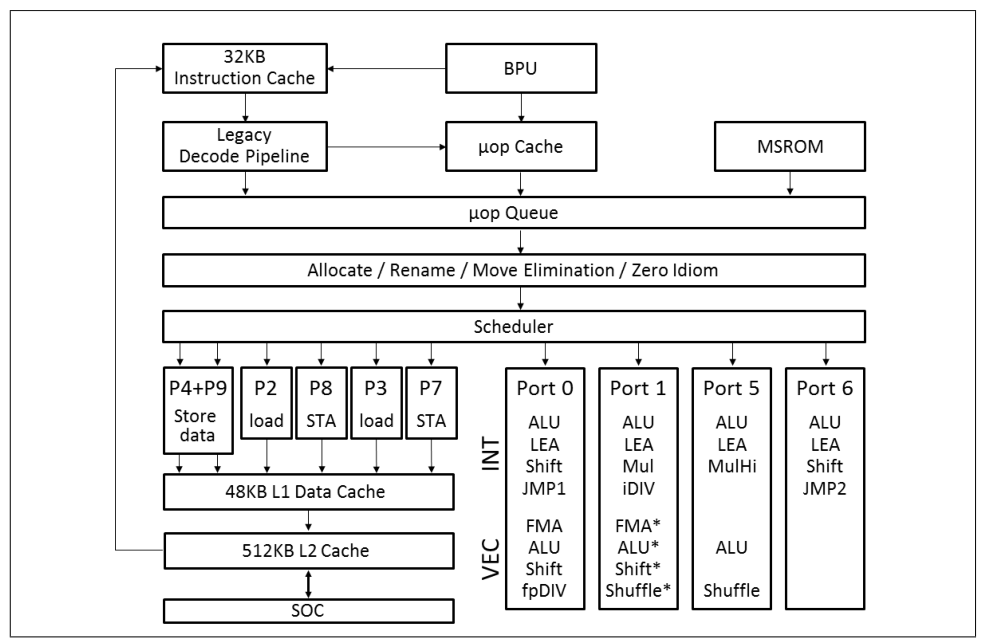
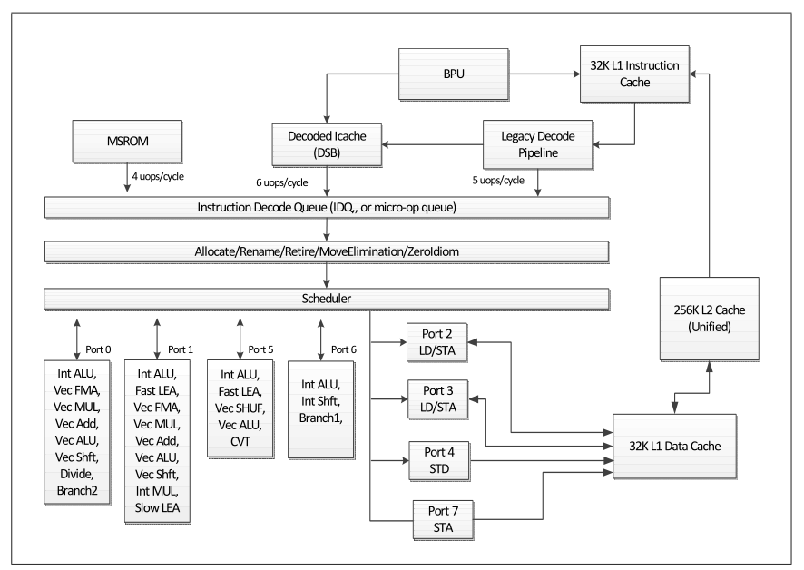
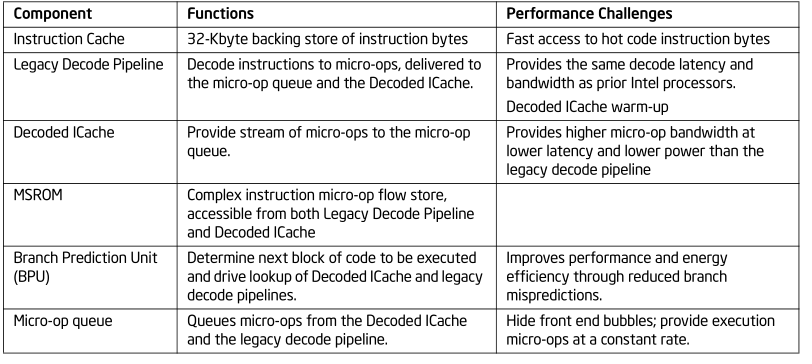
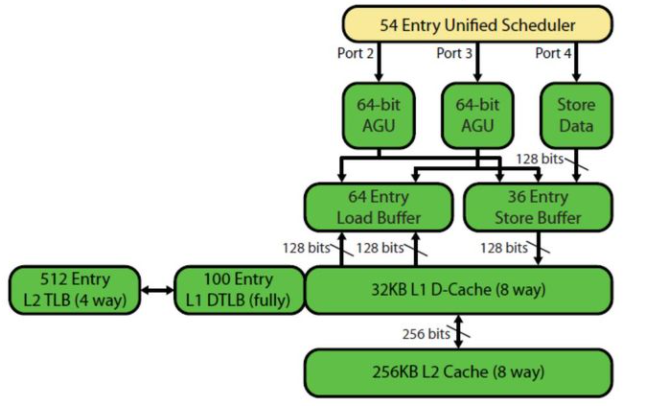
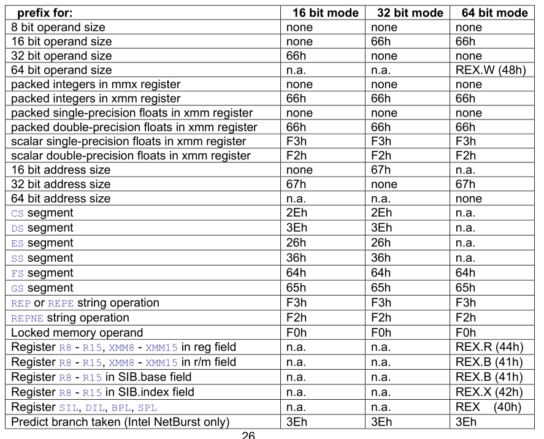
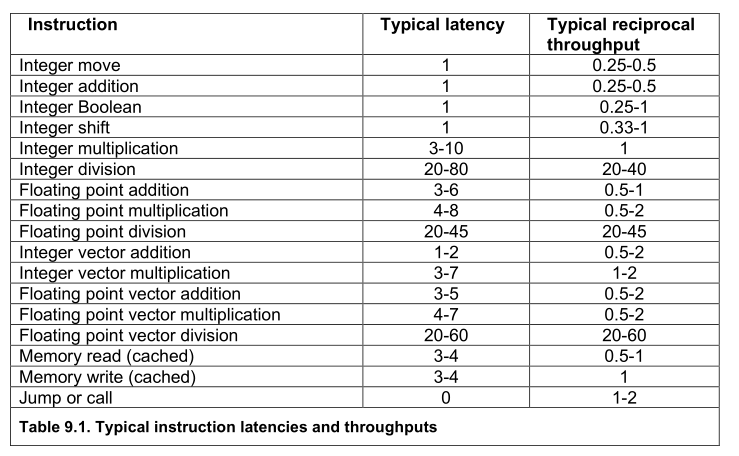
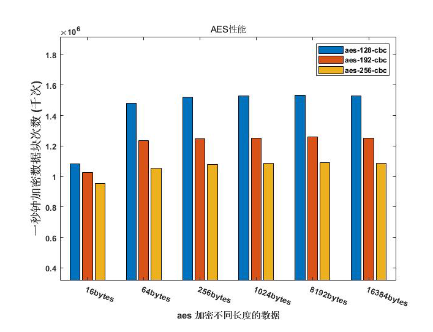
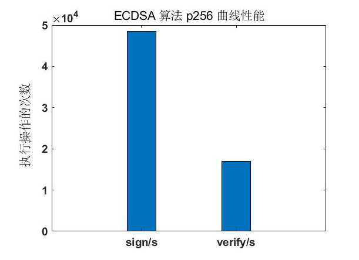
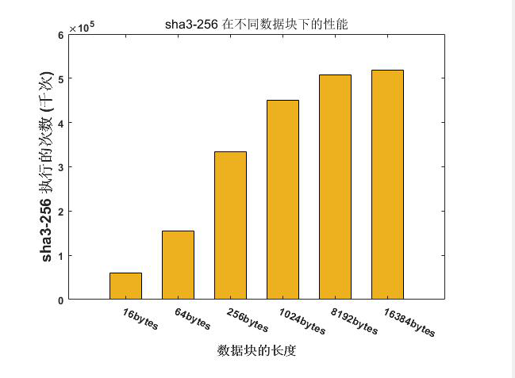
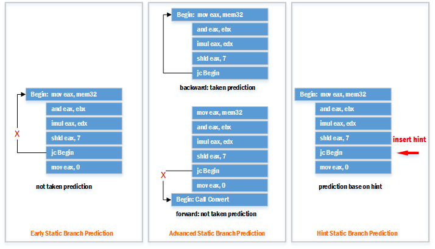

[TOC]

# OpenSSL密码算法 与 微架构层面优化

在任何Intel 64或IA-32处理器上调优一个应用程序以获得高性能需要了解和基本的技能：

1. Intel 64和IA-32架构
2. C语言和汇编语言
3. 程序中对性能有显著影响的 Hot-spot 部分
4. 编译器的优化能力
5. 用于评估程序性能的技术。

下面是Intel 官方 manual “Intel® 64 and IA-32 Architectures
Optimization Reference Manual” 的大概内容：

1. 描述最新的IA-32和Intel 64处理器系列的微架构，以及与软件优化相关的其他特性。
2. 描述通用代码开发和优化技术，适用于所有应用程序，以利用英特尔核心微体系结构、增强英特尔核心微体系结构、英特尔NetBurst微体系结构和奔腾M处理器微体系结构的共同特性。
3. 描述通用的代码开发和优化技术，这些技术利用了英特尔核心微体系结构、增强的英特尔核心微体系结构、英特尔 NetBurst 微体系结构和奔腾 M 处理器微体系结构的共同特性，适用于所有应用程序
4. 描述了使用 MMX™ 技术提供的 SIMD 整数和 SIMD 浮点指令的技术和概念以及如何优化和构建模块。
5. 介绍如何使用 PREFETCH 指令、缓存控制管理指令来优化缓存使用和确定性缓存参数。
6. 描述优化多线程应用程序以实现最佳性能扩展的准则和技术。当目标是多核处理器、支持超线程技术的处理器或多处理器 (MP) 系统时可以使用这些技术。
7. 描述了一套用于在64位模式下运行的应用程序软件的编码准则。
8. 描述使用SSE4.2和其他指令扩展改进文本/字符串处理和词法分析/解析应用程序的SIMD技术。
9. 描述了一些对于使用了 Intel 高级矢量扩展，FMA 和 AVX2 的程序的优化建议和构建模块
10. 3 个附录:
a. 介绍无需编写汇编代码就可以分析和提高应用程序性能的工具
b. 提供关于自顶向下的分析方法和如果使用特定架构下的性能分析时间
c. IA-32指令延迟和吞吐量

## 1 Intel Coffee lake 微架构结构



<center><b>图 1.1 Icelake客户端处理器的流水线</b></center>

说明：

1. 上图中的“*”表示这些功能不适用于512位向量。
2. “INT”代表GPR标量指令。
3. “VEC”代表浮点和整数向量指令。
4. “MulHi”产生iMul运算结果的高64位，iMul~~该~~运算将两个64位寄存器相乘，并将结果放入两个64位寄存器。
5. 端口1上的“Shuffle”是新的，并且仅支持在相同的128位子向量内操作的通道内Shuffle； The “Shuffle” on port 1 is new, and supports only in-lane shuffles that operate within the same 128-bit sub-vector.
6. 端口1上的“iDIV”单元是新的，**相比传统的idiv操作减少了延迟**。

Icelake客户端微架构引入以下新特性：

1. 关键结构规模的显著增加使得OOO执行更加深入。
2. 更宽的机器：allocation由4变成5，执行端口(execution ports)由8变成10
3. 英特尔AVX-512(客户端处理器新增):512位矢量运算，512-bit loads and stores to
   memory，以及32个新的512位寄存器。
4. 每个执行端口有更大的容量 (e.g., SIMD shuffle, LEA), 整除除法减少了延迟
5. 2×BW for AES-NI peak throughput for existing binaries (microarchitectural).



<center><b>图 1.2 coffeelake 微架构流水线示意图</b></center>

cooffeelake微架构的主要组成为：

1. 一个顺序发射的前端，获取指令并将其解码成微操作。前端从程序最有可能执行的路径向下一个流水线阶段提供连续的微操作流。
2. 一种乱序的超标量执行引擎，每个周期最多可调度6个微操作来执行。allocate/rename block将微操作重新排序为“数据流”顺序，这样一旦它们的源准备好并且执行资源可用，它们就可以执行。
3. 一种顺序的退出单元(retirement unit)，确保微操作的执行结果(包括它们可能遇到的任何异常)根据原始程序顺序可见。

cooffeelake 微架构主要分为三个部分：前端，乱序执行引擎，cache 和内存子系统。流水线中的指令流可以按照以下顺序进行总结(出自：2021版-64-ia-32-architectures-optimization-manual.pdf E.2.1)：

1. 分支预测单元从程序中选择下一个要执行的代码块。**处理器按此顺序在以下资源中搜索代码**：
   a. Decoded ICache
   b. 指令 Cache, 通过激活 legacy decode pipeline
   c. L2 cache, last level cache (LLC) and memory
2. 与程序中代码对应的微操作送入 Allocate/Rename/Retire/MoveElimination/Zeroldiom 部件，它们按程序中的顺序进入调度器 (Scheduler), 但是会根据数据流顺序从调度器中回收分配和执行。对于同时准备的微操作，先进先出排序几乎总是保持。微操作执行使用安排在 4 个堆栈中的执行资源来执行。每个堆栈中的执行单元与指令的数据类型相关联。分支错误预测是在分支执行时发出的信号。它重新引导前端，将微操作从正确的路径传送过来。处理器可以将分支错误预测之前的工作与后续修正路径的工作重叠。
3. 对内存操作进行管理和重新排序，以实现并行性和最大性能。未命中L1数据缓存将转到L2缓存。数据缓存是非阻塞的，可以同时处理多个丢失。
4. 异常 (Faults, Traps) 在故障指令的退出阶段(retirement)发出信号。

### 1.1 前端

前端的功能是获取指令并将它们解码为微操作。前端向下一个管道阶段提供微操作连续流，这些微操作来自程序最有可能执行的路径。前端的主要部件单元有： Legacy Decode Pipeline, Instruction Cache, Decoded ICache, MSROM, Branch Prediction Unit, Micro-op queue



<center><b>表 1.1 前端各个单元汇总</b></center>

#### 1.1.1  Legacy Decode Pipeline

Legacy Decode Pipeline 包括 instruction translation lookaside buffer (ITLB)、指令缓存(ICache)、指令预解码和指令解码单元。首先我们通过查询 ITLB 来从指令缓存中取指令，速度上可以做到 16 bytes/s。指令预解码单元从 ICache 中接收 16 bytes 的指令并确定指令的长度。指令解码阶段有 5 个解码单元可以将指令解码成微操作，其中第一个解码单元可以解码所有的 IA-32 和 Intel 64，最多 4 个微操作。其余 4 个解码单元处理单个微操作指令。所有 5 个解码单元都支持单个微操作流程的常见情况，包括 micro-fusion 和 macro-fusion。解码器发出的微操作被定向到微操作队列和 Decoded ICache。超过四个微操作的指令从 MSROM 中生成它们的微操作。MSROM带宽为每周期4个微操作。微操作来自MSROM的指令可以从 legacy decode pipeline 或 Decoded ICache 开始。

下面介绍解码过程中的两个步骤：

1. Micro-Fusion

   Micro-Fusion 将来自同一指令的多个微操作融合为一个单一的复杂微操作, 如果没有Micro-Fusion ，复杂的微操作将在乱序执行核心中被分配多次。

2. Macro-Fusion

   宏观融合将两个指令合并成一个微操作。

#### 1.1.2 Decoded ICache

Decoded ICache 本质上是 legacy decode pipeline 的加速器。通过存储解码指令，解码ICache实现了以下特性：

1. 减少了分支错误预测的延迟

2. 增加了微指令送入乱序执行引擎的贷款

3. 降低前端功耗。

Decoded ICache 缓存了指令解码器的输出。下一次使用微操作执行时，将从 Decoded ICache 中获取已解码的微操作。这使得这些微操作可以跳过 fetch 和 decode 阶段，并减少了前端的功耗和延迟。Decoded ICache 实现了超过 80％ 的微操作命中;此外，“热点”的微操作通常接近100%。

#### 1.1.3 Branch Prediction

分支预测预测分支目标，并使处理器在知道分支真正执行路径之前就开始执行指令。所有分支都使用分支预测单元(BPU)进行预测。这个单元预测时不仅基于分支的EIP，也会根据执行到达该EIP的执行路径来预测目标地址。BPU可以有效预测以下分支类型：

• 条件分支
• Direct calls and jumps
• Indirect calls and jumps
• Returns

#### 1.1.4 Micro-op Queue and the Loop Stream Detector (LSD)

微操作队列 (IDQ) 将前端和乱序执行引擎分离。它在微操作生成和重命名之间。该队列有助于隐藏前端各种微操作源之间引入的气泡，并确保每个周期交付4个微操作以供执行。IDQ中有一个un-lamination process 用于分解 complex micro-op 为多个 simple micro-op，IDQ中的 micro-op 都是simple类型的，也就是 atomic op，IDQ会在一个cycle dispatch 多个micro-ops到out-of-order engine执行。例如间接跳转指令就会被分解为load and jmp两条指令。

### 1.2 乱序执行引擎

乱序执行引擎利用 allocate 为 store micro-op 和 load micro-op 分配对应的 store-buffer entry 和 load-buffer entry 资源（后面讲cache-hierarchy的时候会详解）；利用renamer将寄存器依赖的 micro-op 指令序列解构成可乱序执行序列；不能乱序执行的序列(例如间接跳转必须等到load target addr返回后才能执行)由 scheduler 调度执行。

### 1.3 cache 和内存子系统

Cache系统根据其在CPU与MMU之间的位置的不同又分为：logical cache和physical cache


<center><b>图 1.3 逻辑 cache 与物理 cache</b></center>

上图显示了 Cache 在 CPU 与 MMU 之间被称为Logical cache，在 MMU 与 Main memory 之间被定义为 Physical cache。X86架构的L1 cache 用的是VIPT。这样cache物理实现相对简单，而且同一快物理内存在cache中有且仅有一份，至少在cache内部不存在数据一致性问题，不同core的cache的数据一致性还是用MESI协议解决。

#### 1.3.1 logical cache

逻辑缓存存储数据用的是虚拟地址，简称VIVT（virtual index virtual tag）。这样做的好处是CPU发出的虚拟地址不用经过MMU，直接就可以和Cache中每个cache line中存储的tag（虚拟地址）比较获取数据。

#### 1.3.2 physical cache

物理缓存存储数据用的是物理地址，简称VIPT（virtual index physical tag）。

这样CPU发出的虚拟地址要经过MMU转换成物理地址，然后才能与cache line中的tag匹配以获取数据。

但是VIVT相对于VIPT有点复杂，会引入一些问题。

例如，当一个进程的多个线程的不同虚拟地址映射到相同的物理地址的话，logical cache就有可能出现不同的cache line存储相同物理地址的数据，这个时候缓存内的数据一致性就是大麻烦，还有不同进程的相同虚拟地址会映射到不同的物理地址，这个时候logical cache如何区分这两个属于不同进程的相同虚拟地址；当然可以通过在cache line增加额外的字段来实现上述的问题，但这势必大大会减少cache存储实际数据的容量，还有会大幅增加了cache的物理实现复杂度。

#### 1.3.3 不同种类的cache之间的关联关系



<center><b>图 1.4 cache system architecture</b></center>

下面通过两条访存指令来详解图7中各个cache是如何被使用的:

1. Load operation （movl offset(%eax),%edx

LDP部分会将该类型指令 decode 为一条 simple micro-op 存储在DSB中，然后DSB会将 micro-op 发送到IDQ中，IDQ会根据micro-op的类型决定是否对其进行 un-lamination 操作，然后 IDQ将自己处理过的 micro-op 发送到 out-of-order engine（Ooo engine）乱序执行。Ooo engine首先根据micro-op的操作类型分辨出它是个read操作，然后allocate就会在Load buffer中为其分配一个entry用于存储未来从L1D-Cache获取的data；renamer或scheduler会将该micro-op发送到execute engine对应的port处理。

## 2 性能优化

### 2.1 性能优化总则

1. 至少以下寄存器可以重命名 : 所有通用寄存器、堆栈指针、标志寄存器、浮点寄存器和向量寄存器。一些cpu也可以重命名段寄存器和浮点控制字。
2. 通过写入完整寄存器而不是部分寄存器来防止错误依赖。
3. INC和DEC指令在一些cpu上是低效的 because they write to only **part of the flags register** (excluding the carry flag). 使用ADD或SUB来代替，以避免错误依赖或低效的标志寄存器拆分，特别是当它们后面跟着读取标志的指令时，这种拆分寄存器效应会尤为明显。
4. 一种指令链，其中每条指令都依赖于前一条指令，不能无序执行。避免长依赖链。(见64页)。
5. 内存操作数不能重命名
6. 在大多数情况下，内存读可以在前一个内存写到不同地址之前执行。任何指针或索引寄存器应该尽早计算，以便CPU可以验证内存操作数的地址是不同的。
7. 内存写操作可能无法在前一次写操作之前执行，但是写缓冲区可以容纳大量挂起的写操作，通常是4个或更多。
8. 在大多数处理器上，一次内存读操作可以在另一次读操作之前或同时执行。
9. 如果代码包含不同类别的指令，例如:简单整数指令、浮点或向量指令、内存读取和内存写入，CPU可以同时做更多的事情。

### 2.2 优化前端

#### 2.2.1 指令编码

指令代码的格式在Intel和AMD的手册中有详细描述。这里解释指令编码的基本原理，因为**它与微处理器的性能**有关。通常，您可以依赖汇编程序来生成指令的尽可能小的编码。

每条指令可以按所提到的顺序由下列元素组成：

1. Prefixes

   这些前缀用于修改后面的操作码的含义

2. Opcode (1-3 bytes)

   This is the instruction code. It can have these forms:

   Single byte: XX ，Two bytes: 0F XX ，Three bytes: 0F 38 XX or 0F 3A XX

   形式为0f38xx的三个字节的操作码总是有一个mod-reg-r/m字节，并且没有置换。形式为0F 3A XX的三个字节的操作码总是有一个mod-regr/m字节和一个字节的位移

3. mod-reg-r/m byte (0-1 byte)

   这个字节指定操作数。它由三个字段组成。The 模式字段 is two bits specifying the 寻址模式, the reg field 长 3 bit 用来指定寄存器 for the first operand (一般是目的操作数), the r/m field is 3-bit
   specifying the second operand (most often the 源操作数), which can be a register or a memory operand. 如果只有一个操作数，reg字段可以是操作码的一部分。

4. SIB byte (0-1 byte)

   这个字节用于具有复杂寻址模式的内存操作数，并且仅在有mod-reg-r/m字节的情况下使用。它有两个比特用于scale factor，三个比特指定scaled index register，三个比特指定基指针寄存器。在以下情况下需要SIB字节

   a. 如果一个内存操作数有两个指针或索引寄存器,

   b. 如果一个内存操作数有一个索引寄存器,

   c. 如果一个内存操作数 has the stack pointer (ESP or RSP) as base pointer,

   d. 如果一个内存操作数在64位模式下使用一个32位 sign-extended direct memory 地址，而不是 a RIP-relative address.

   不能在16位寻址模式中使用SIB字节。

5. Displacement (位移) (0, 1, 2, 4 or 8 bytes)

   这是内存操作数地址的一部分. It is added to the 指针寄存器的值上 (base or index or both), 如果有的话

   A 1-byte sign-extended displacement is possible 在所有寻址模式下 if a pointer register is specified.

   A 2-byte 位移(displacement) is possible only in 16-bit 寻址模式.
   A 4-byte displacement is possible in 32-bit addressing mode.
   A 4-byte sign-extended displacement is possible in 64-bit addressing mode.

   如果指定了任何指针寄存器，则将位移添加到这些寄存器中。如果没有指定指针寄存器，也没有SIB字节，则将位移添加到RIP中。如果有一个SIB字节而没有指针寄存器，则符号扩展值是一个绝对直接地址。

   对于一些没有mod-reg-r/m字节的MOV指令，在64位寻址模式下可以使用8字节的绝对直接地址。

6. Immediate operand (0, 1, 2, 4 or 8 bytes)

   这是一个数据常量，在大多数情况下是操作的源操作数。对于除MOV、CALL和RET之外的所有具有立即操作数的指令，

   1字节符号扩展立即操作数在所有模式下都是可能的。

   对于具有16位操作数大小的指令，2字节立即操作数是可能的。

   对于具有32位操作数大小的指令，可以使用4字节的立即操作数。

   对于具有64位操作数大小的指令，可以使用4字节的符号扩展立即操作数。

   An 8-byte immediate operand is possible only for moves into a 64-bit register.

#### 2.2.2 Instruction prefixes



<center><b>表 2.1 the use of instruction prefixes</b></center>

在 flat memory model 中很少需要段前缀。只有当一个内存操作数有基本寄存器BP、EBP或ESP，并且需要DS段而不是SS时才需要DS段前缀。

#### 2.2.3 Instruction fetch, decoding and retirement

指令获取可能成为瓶颈。许多处理器不能在每个时钟周期中获取超过16字节的指令代码。如果这个限制非常重要，那么有必要让指令越短越好。使指令变短的一种方法是用指针替换内存操作数(见第10章第72页)。如果指令获取是瓶颈，内存操作数的地址可能被加载到循环外的指针寄存器中。大常量也可以被加载到寄存器中。

在大多数处理器上，指令的获取会因跳转而延迟。重要的是尽量减少关键代码中的跳转次数。未被获取和正确预测的分支不会延迟指令的获取。因此，组织 if-else 分支是有利的，以便最常跟随的分支是不采取条件跳转的分支。

大多数处理器以16字节或32字节块对齐的方式获取指令。将关键循环项和子例程项按16对齐，以使代码中16字节边界的数量最小化，这可能是有益的。或者，确保在关键循环项或子例程项之后的前几条指令中没有16字节边界。

指令解码常常是一个瓶颈。给出最佳解码的指令的组织是特定于处理器的。在AMD处理器上，最好避免产生超过2个µops的指令。

带有多个前缀的指令会减慢解码速度。在不减慢解码速度的情况下，一条指令可以拥有的前缀的最大数量取决于CPU。避免地址大小前缀。在带有立即操作数的指令上避免使用操作数大小前缀。例如，首选用 `MOV EAX,2` 代替 `MOV AX,2`

一些 cpu 有一个 µop cache 或一个很小的环回缓冲区，以帮助消除在小循环中解码指令的瓶颈。保持循环较小，以便它们能够适合写入µop缓存或环回缓冲区。避免不必要的循环展开。**意思就是不用解码了**

#### 2.2.4 Jumps and calls

跳转、分支、调用和返回不一定会增加代码的执行时间，因为它们通常会与其他内容并行执行。然而，在关键代码中，跳跃等的数量应保持在最低限度，原因如下:

1. 根据微处理器的不同，在无条件跳转或条件跳转之后的代码获取通常会被延迟1-3个时钟周期。如果目标靠近16字节或32字节的代码读取块的末尾(即在一个能被16整除的地址之前)，延迟是大的。
2. 当在不连续的子例程之间来回跳转时， code cache 存变得碎片化，效率降低。
3. 当代码包含许多跳转时，带有µop缓存或跟踪缓存的微处理器很可能在这个缓存中存储 multiple
   instances of the same code
4. 分支目标缓冲区(BTB)只能存储有限数量的跳转目标地址。一次BTB失败将消耗许多时钟周期。
5. 条件跳转根据高级分支预测机制进行预测。错误的预测代价高昂，如下所述。
6. 在大多数处理器上，分支可以在全局分支模式历史表和分支历史寄存器中相互干扰。因此，一个分支可能会降低其他分支的预测率。 通过使用返回堆栈缓冲区来预测返回，该缓冲区只能容纳有限的返回地址，通常是16个。
7. 在旧处理器上，间接跳转和间接调用的预测很差。

所有现代cpu都有一个执行流水线，其中包括指令预取、译码、寄存器重命名、重排序和 scheduling,、execution、退出等阶段。流水线中的阶段数量从12到22不等，这取决于具体的微体系结构。当一个分支指令被送入管道时，CPU并不确定哪条指令是下一个要进入流水线的指令。在执行分支指令之前，它要多花12-22个时钟周期，这样才能确定分支的运行方向。这种不确定性很可能会打破流水线的流动。CPU不会等待12个或更多的时钟周期来等待一个答案，而是尝试猜测分支将朝哪个方向发展。猜测是基于该分支以前的行为。如果分支最近几次都走相同的路，那么预计这次也会走相同的路。如果分支在这两种方式之间有规律地交替，那么可以预测它将继续交替。

如果预测是正确的，那么CPU可以通过将正确的分支加载到流水线中并开始解码并推测执行该分支中的指令来节省大量时间。如果预测是错误的，那么在几个时钟周期之后会发现错误，必须通过刷新流水线并丢弃 speculative
executions 的结果来修复错误。一个分支错误预测的成本范围从12到50多个时钟周期，取决于流水线的长度和微体系结构的其他细节。这个代价是如此之高，以至于为了细化分支预测已经实现了非常先进的算法。这些算法在手册3中详细解释:“The microarchitecture of Intel, AMD and VIA CPUs”。

一般来说，你可以假设分支在以下情况下大部分时间都是正确预测的:

1. 如果分支总是沿着相同的方向。
2. 如果分支遵循一个简单的重复模式，并且处于一个只有很少或没有其他分支的循环中
3. 如果该分支与前一个分支相关。
4. 如果分支是一个具有常量的循环，则重复计数较小，并且循环内部很少或没有条件跳转。

最坏的情况是一个分支在大约50%的时间里向两边移动，不遵循任何规则模式，并且与之前的任何分支都不相关。这样的一个分支在50%的情况下会被错误预测。This is so costly that the branch should be replaced by
conditional moves or a table lookup if possible.

通常，您应该尽量使预测不好的分支数量保持在最小值，并使循环中的分支数量保持在最小值。如果**拆分或展开**循环可以减少循环内部的分支数量，那么拆分或展开循环可能是有用的。

间接跳转和间接调用往往预测不好。旧的处理器将简单地预测一个间接跳转或调用，以与上次相同的方式进行。许多较新的处理器能够识别间接跳转的简单重复模式。

通过所谓的 return stack buffer 来预测返回值，该缓冲区是一个先进后出的缓冲区，它反映了推入堆栈的返回地址。一个有16项的返回堆栈缓冲区可以在最多16个嵌套级别上正确预测子例程的所有返回。如果子例程嵌套级别比返回堆栈缓冲区的大小更深，那么失败将在外部嵌套级别上看到，而不是可能更关键的内部嵌套级别。因此，除深度嵌套的递归函数外，在大多数情况下，return stack buffer 的大小为8或更多就足够了。

如果有一个没有匹配return的调用或没有前面调用的return，则返回堆栈缓冲区将失败。因此，始终匹配调用和返回非常重要。不要通过除RET指令以外的任何其他方法跳出子例程，除非在后面解释的尾部调用中。并且不要将RET指令用作间接跳转。远调用应该与远返回匹配。

1. Make conditional jumps most often not taken

在大多数处理器上，未采取分支的效率和吞吐量都优于采取分支。Therefore, it is good to place the most frequent branch first:

```asm
; Example 9.5, Place most frequent branch first 
Func1: 
    cmp eax,567 
    je L1 
    ; frequent branch 
    ret 
L1: ; rare branch 
    ret
```

#### 2.2.5 Micro-operations

另一个重要的特征是将指令分解为微操作 (缩写为µops或uops) 。`push eax` 指令做两件事。它从堆栈指针中减去4，并将 eax 存储到堆栈指针所指向的地址。现在假设eax是一个漫长而耗时的计算结果。这会延迟推送指令。

```asm
; Example 9.2, Splitting instructions into uops 
push  eax 
call  SomeFunction 
```

调用指令依赖于被推入指令修改的堆栈指针的值。如果指令没有被分割成 `µops`，那么调用指令将不得不等待，直到推送指令完成。但是CPU将 `push eax` 指令分成 `sub esp,4` 和 `mov [esp]，eax`。`sub esp,4` 微操作可以在eax准备好之前执行，所以调用指令只等待 `sub esp,4`，而不等待 `mov [esp]，eax`。

### 2.3 优化执行部件

#### 2.3.1 Execution units

当CPU可以同时做多件事情时，乱序执行甚至会变得更有效率。如果要做的事情彼此独立，并且不在CPU中使用相同的执行单元，那么许多CPU可以同时做两件、三件或更多的事情。现代cpu至少有两个整数ALU (算术逻辑单元)，所以它们可以在**每个时钟周期中做两个或更多的整数加法**。现代的cpu也可以有两个浮点运算单元，这样就可以同时进行两个浮点运算。可能有一个或两个存储器读单元和一个存储器写单元，以便能够同时对存储器进行读和写。在许多处理器上，每个时钟周期的最大平均 µops 是3个或4个。例如，可以在同一个时钟周期内执行整数操作、浮点操作和内存操作。根据CPU的不同，每个时钟周期的最大算术操作数(即除了内存读写以外的任何操作)被限制为2个、3个或4个。

#### 2.3.2 Instruction latency and throughput

出自：The microarchitecture of Intel, AMD and VIA CPUs，12.6；Optimizing subroutines in assembly language，9.4

简单整数指令的延迟为一个时钟周期。乘法、除法和浮点指令具有更长的延迟。与大多数其他处理器不同，我发现在同一流水线中混合不同延迟的指令时，Atom处理器没有延迟。LEA指令使用地址生成单元(AGU)而不是算术逻辑单元。由于AGU和算术逻辑单元之间的距离，当依赖于指针寄存器或索引寄存器时(a pointer register or index register)，这会导致4个时钟周期的延迟。因此，在大多数情况下，使用加法和移位指令比使用LEA指令更快。

一条指令的延迟是指从指令开始执行到结果就绪所花费的时钟周期数。执行依赖链所需的时间是该链中所有指令延迟的总和。

如果指令是独立的，那么一条指令的吞吐量就是每个时钟周期所能执行的同类指令的最大数量。I prefer to list the reciprocal throughputs because this makes it easier to compare latency and throughput. The reciprocal throughput is the **average time it takes from the time an instruction starts to execute till another independent instruction of the same type can start to execute**, or the number of clock cycles per instruction in a series of independent instructions of the same kind.

例如，Core 2 处理器上的浮点加法延迟为3个时钟周期，每条指令的 reciprocal throughput 为1个时钟。这意味着，如果每次加法依赖于前一次加法的结果，处理器每次加法使用3个时钟周期，但如果加法是独立的，则每次加法只使用1个时钟周期。

The following list shows some typical values:



<center><b>表 2.2 各个指令类型的 latency 与 throughput</center></b>

**注意**："jump"和"call"指令，虽然他们的latency为0，可是它们的吞吐量倒数为1-2，所以在某个微架构下，一个jump指令的倒数吞吐量为2，那么在两个周期内，该处理器最多也只能执行一个jump指令

#### 2.3.3 Break dependency chains

为了利用无序执行的优势，您必须避免长依赖链。考虑下面的c++示例，它计算100个数字的和:

```asm
// Example 9.3a, Loop-carried dependency chain 
double list[100], sum = 0.; 
for (int i = 0; i < 100; i++) sum += list[i]; 
```

这段代码做了100次加法，每次加法都取决于前一次加法的结果。This is a loop-carried dependency chain。一个循环携带的依赖链可以很长，完全阻止了 out-of-order execution for a long time。只有 i 的计算可以与浮点数加法并行进行。

假设浮点加法器的延迟为4，吞吐量为1，那么最优实现将有4个累加器，这样我们在浮点加法器的流水线中总是有4个加法。在c++中，它看起来像:

```asm
// Example 9.3b, Multiple accumulators 
double list[100], sum1 = 0., sum2 = 0., sum3 = 0., sum4 = 0.; 
for (int i = 0; i < 100; i += 4) { 
   sum1 += list[i];
   sum2 += list[i+1]; 
   sum3 += list[i+2]; 
   sum4 += list[i+3]; 
} 
sum1 = (sum1 + sum2) + (sum3 + sum4); 
```

这里我们有四个并行运行的依赖链，每个依赖链都是原始依赖链的四分之一。累加器的最佳数量是指令的延迟时间(在本例中是浮点数相加) 除以 reciprocal throughput。

也许不可能获得理论上的最大吞吐量. The more parallel dependency chains there are, the more difficult is it for the CPU to schedule and reorder the µops optimally. It is particularly difficult if the dependency chains are branched or entangled.

一些微处理器可以在每个时钟周期中执行4到5条指令。微处理器支持的指令级并行性越多，避免长依赖链就越重要。依赖链不仅出现在循环中，也出现在线性代码中。这种依赖链也可以被打破。例如，y = a + b + c + d可以更改为y = (a + b) + (c + d)，这样两个括号就可以并行计算。

将寄存器设置为零的常用方法是XOR EAX,EAX或SUB
EAX,EAX。有些处理器认为这些指令独立于寄存器的先前值。任何使用寄存器新值的指令都不必在XOR或SUB指令准备好之前等待该值。这些指令有助于打破不必要的依赖关系。对于32位和64位通用寄存器，以及128位或更多的向量寄存器，大多数现代处理器都可以将具有两个相同输入寄存器的异或指令视为独立于先前值的异或指令。

`SBB EAX,EAX` 依赖于进位标志，即使它不依赖于 EAX 。

您也可以使用这些指令来打破对标志的依赖关系。例如，在一些英特尔处理器中，rotate instructions have a false dependence。这可以通过以下方式删除:

```asm
; Example 9.4, Break dependence on flags 
ror  eax, 1 
xor  edx, edx    ; Remove false dependence on the flags 
ror  ebx, 1
```

#### 2.3.4 Pipelined instructions

浮点运算通常需要多个时钟周期，但它们通常是流水线化的，例如，一个新的浮点运算可以在之前的运算完成之前开始。在大多数cpu上，向量指令甚至对整数指令都使用浮点执行单元。关于哪些指令可以同时执行或流水线执行以及每个指令需要多少个时钟周期的细节是CPU特定的。手册3:“Intel, AMD和VIA CPU的微架构”和手册4:“指令表”解释了每种类型的CPU的详细信息。

#### 2.3.5 Partial registers

有些cpu可以将寄存器的不同部分分开，而有些cpu总是将寄存器作为一个整体来对待。如果我们改变示例9.1b，使其第二部分使用16位寄存器，那么我们就会遇到虚假依赖 (false dependence) 的问题:

```asm
; Example 9.1c, False dependence of partial register 
mov eax, [mem1]       ; 32 bit memory operand 
imul eax, 6 
mov [mem2], eax 
mov ax, [mem3]        ; 16 bit memory operand 
add ax, 2 
mov [mem4], ax
```

一些来自Intel, AMD 和 VIA 的 cpu 无法重命名部分寄存器。结果是 line 5 `mov ax，[mem3]` 指令必须等待 line3 `imul` 指令完成，因为它需要将[mem3]的16位低位与imul指令的16位高位相结合。

其他cpu可以将寄存器分割成多个部分，以避免虚假的依赖关系，但这有另一个缺点，如果这两个部分必须重新连接在一起。例如，假设示例9.1c中的代码后面跟着PUSH EAX。在一些处理器上，这个指令必须等待EAX的两个部分 retire，以便将它们连接在一起，代价是5-6个时钟周期。其他处理器将生成一个额外的µop来连接寄存器的两个部分。

用 `movzx eax，[mem3]` 替换 `mov ax，[mem3]` 可以避免这些问题。这重置了eax的高位，并打破了对eax之前任何值的依赖。在64位模式下，写入32位寄存器就足够了，因为这总是重置64位寄存器的上部。因此，`movzx
eax，[mem3]` 和 `movzx rax，[mem3]` 做的是完全相同的事情。32位版本的指令比64位版本短一个字节。应该避免使用任何高8位寄存器AH、BH、CH、DH，因为它会导致错误的依赖关系和低效率的代码。

## 3 OpenSSL 算法性能

相关配置如下：

| 配置         | 参数                    |
| ------------ | ----------------------- |
| cpu型号      | Intel Core i7-9750H     |
| 微架构       | coffee lake             |
| openssl 版本 | OpenSSL 3.0.0-beta1-dev |
| 内存         | 24G                     |
| 编译器       | gcc                     |
| 操作系统     | ubuntu 18.04            |

### 3.1 AES 算法性能

以下是采用 openssl 最新版本 openssl 3.0 中的 cbc 加密方式的 AES 的性能测试结果，本次实验数据使用 AES 在 3s 内加密的总字节数取平均值得到的每秒加密的字节数，单位为 k (千次)

<center><b>表 3.1 AES 每秒加密的比特数</center></b>

| type          | aes_128_cbc | aes_192_cbc | aes_256_cbc |
| ------------- | ----------- | ----------- | ----------- |
| 16 bytes      | 1081132.72k | 1027538.52k | 955896.36k  |
| 64 bytes      | 1480418.50k | 1236308.86k | 1054223.32k |
| 256   bytes   | 1521022.46k | 1249708.97k | 1078917.55k |
| 1024   bytes  | 1527353.34k | 1250016.60k | 1085918.21k |
| 8192   bytes  | 1534328.83k | 1261488.81k | 1091332.78k |
| 16384   bytes | 1528971.26k | 1250568.87k | 1085687.67k |



结果显示 AES 加密算法的性能随着加密分组的长度增长而变低，在加密相同数据块的情况下，256 bytes 分组的 AES 算法在性能上显然要比 128 bytes 分组的 AES 算法要差；而且随着加密数据块的增长，AES 算法的性能也会有所提升，在相同分组长度的 AES 算法下，加密 16384 bytes 的数据块每秒加密的字节数最多。

### 3.2 ECDSA 算法性能

以下是采用 openssl 最新版本 openssl 3.0 中的 ECDSA 的性能测试结果，使用的曲线时 openssl 中优化程度最高的 NISTP256 v1 曲线，本次实验数据使用 ECDSA 在 10s 内签名和验签的次数取平均值得到的每秒的签名和验签次数

<center><b>表 3.2 ECDSA 签名和验签的性能</center></b>

| 曲线名       | sign        | verify  | sign/s  | verify/s |
| ---------- | ----------- | ------- | ------- | -------- |
| NISTP256v1 | 0.00002s | 0.0001s | 48523.2 | 16998.3  |



结果表明验签所需的时间要远大于签名的时间，签名和验签在一秒钟的执行次数均达到了万级别。

### 3.3 sha3 算法性能

以下是采用 openssl 最新版本 openssl 3.0 中的 sha3-256 的性能测试结果，本次实验数据是 3s 内进行哈希的总字节数取平均值得到的每秒加密的字节数，单位为 k (千次)。

<center><b>表 3.3 256 位的 sha3 算法的性能</center></b>

|   type   | 16 bytes  | 64 bytes   | 256 bytes  | 1024 bytes | 8192 bytes | 16384 bytes |
| :------: | --------- | ---------- | ---------- | ---------- | ---------- | ----------- |
| sha3-256 | 60639.23k | 155769.41k | 334447.36k | 450607.45k | 507382.44k | 518296.92k  |



结果表明，sha3-256 处理的单个数据块越大，单位时间内处理的字节数越多

## 4 几个基于微架构优化的例子

### 4.1 基于静态分支预测的优化

Static Branch Prediction是最简单的分支预测，因为它不依赖于历史的分支选择。Static Branch Prediction可以细分为三类：

- Early Static Branch Prediction，总是预测接下来的指令不走跳转分支，即执行位于跳转指令前方相邻（比当前指令晚执行）的指令。
- Advanced Static Branch Prediction，如果所跳转的目标地址位于跳转指令的前方（比当前指令晚执行），则不跳转；如果所跳转的目标地址位图跳转指令的后方（比当前指令早执行）则跳转。这种方法可以很有效地应用在循环的跳转中。
- Hints Static Branch Prediction，可以在指令中插入提示，用于指示是否进行跳转。x86架构中只有Pentium 4用过这种预测方式。



目前的Intel处理器会在缺少历史分支信息的时候采用Advanced Static Branch Prediction来进行分支预测，也就是说如果某分支在第一次执行时会采用该预测方式。因此我们在进行编码是需要进行注意，以便优化代码的执行效率。

```py
//Forward condition branches not taken (fall through)
IF<condition> {....
↓
}
 
//Backward conditional branches are taken
LOOP {...
↑ −− }<condition>
 
//Unconditional branches taken
JMP
------→
```

碰到IF条件语句时会预测走不命中分支，碰到循环（while在循环首部除外）时默认进入循环，碰到无条件跳转则必然走跳转分支了。**意思就是说大概率会执行的代码你应该放在 if 语句前面，大概率不执行的代码，你需要将代码放在后面；对于循环语句可以使用 `do while` 和 `while` 两种方式之间的切换来实现**

### 4.2 避免间接分支预测对数据的强依赖性

写一段c++代码，用256的模数随机填充一个固定大小的大数组，然后对数组中大于 128 的数据求和：

在源程序中主要运行部分的代码为：

```c++
if (data[c] >= 128)
    sum += data[c];   
```

对应的汇编代码为：

```asm
cmp edx, 128
jl SHORT $LN3@main
add rbx, rdx
$LN3@main:
```

数组 data 的数据是随机生成的，如果对 data 事先进行排序的话，那么该程序执行的会比较快；如果不排序，该程序执行的就会比较慢，简单地分析一下：

有序数组的分支预测流程：

```py
T = 分支命中
N = 分支没有命中

data[] = 0, 1, 2, 3, 4, ... 126, 127, 128, 129, 130, ... 250, 251, 252, ...
branch = N  N  N  N  N  ...   N    N    T    T    T  ...   T    T    T  ...

       = NNNNNNNNNNNN ... NNNNNNNTTTTTTTTT ... TTTTTTTTTT  (非常容易预测)
```

无序数组的分支预测流程：

```py
data[] = 226, 185, 125, 158, 198, 144, 217, 79, 202, 118,  14, 150, 177, 182, 133, 
branch =   T,   T,   N,   T,   T,   T,   T,  N,   T,   N,   N,   T,   T,   T,   N 

       = TTNTTTTNTNNTTTN ...   (完全随机--无法预测)
```

在本例中，由于data数组元素填充的特殊性，决定了分支预测器在未排序数组迭代过程中将有50%的错误命中率，因而执行完整个sum操作将会耗时更多。

我们可以利用位运算取消分支跳转。
基本知识：

```py
|x| >> 31 = 0 # 非负数右移31为一定为0
~(|x| >> 31) = -1 # 0取反为-1

-|x| >> 31 = -1 # 负数右移31为一定为0xffff = -1
~(-|x| >> 31) = 0 # -1取反为0

-1 = 0xffff
-1 & x = x # 以-1为mask和任何数求与，值不变
```

故分支判断可优化为：

```py
int t = (data[c] - 128) >> 31; # statement 1
sum += ~t & data[c]; # statement 2
```

分析：

1. `data[c] < 128`, 则statement 1值为: 0xffff = -1, statement 2等号右侧值为: `0 & data[c] == 0`;
2. `data[c] >= 128`, 则statement 1值为: 0, statement 2等号右侧值为: `~0 & data[c] == -1 & data[c] == 0xffff & data[c] == data[c]`;

故上述位运算实现的sum逻辑完全等价于if-statement, 若想避免移位操作，可以使用如下方式：

```py
int t=-((data[c]>=128)); # generate the mask
sum += ~t & data[c]; # bitwise AND
```

## 参考文献

[1] [深入理解 CPU 的分支预测](https://blog.csdn.net/hanzefeng/article/details/82893317)

[2] [Spectre原理详解及分支毒化的实现](https://zhuanlan.zhihu.com/p/114680178)

[3] Intel® 64 and IA-32 Architectures Optimization Reference Manual

[4] Agner Fog, 性能优化手册, Optimizing subroutines in assembly language

[5] Agner Fog, 性能优化手册, The microarchitecture of Intel, AMD and VIA CPUs, An optimization guide for assembly programmers and compiler makers

[6] Agner Fog, Test programs for measuring clock cycles and performance monitoring
