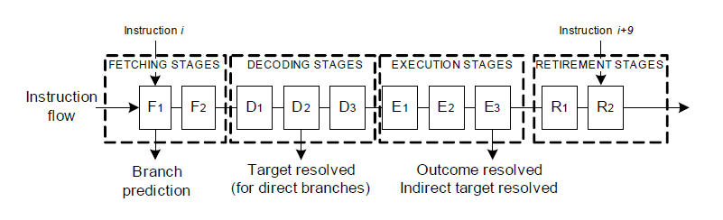

阅读一些资料时的阅读笔记

## The microarchitecture of Intel

Agner Fog的性能优化手册的卷3，手册全名：The microarchitecture of Intel, AMD and VIA CPUs

关于该手册的一些笔记，笔记按手册的标题划分

手册来源： <http://www.agner.org/optimize>

手册本地位置："F:\iii\ii\i\reference\性能优化\microarchitecture.pdf"

### 术语解释

- control transfer instruction：就是指一类指令，如 jump，call 之类的

### Branch prediction in PMMX, PPro, P2, and P3

手册3.3节的笔记

#### BTB的结构

BTB，branch target buffer

PMMX 中的BTB有 256 个条目，为 16 组\*16 路。

**问：** 每个条目式如何被识别是属于内存中的哪个控制传输指令(control transfer instruction)？

**答：** 通过跳转指令的内存地址来标识内存中的每一个跳转指令。

具体为：PPMX 处理器下，跳转指令的最后一个字节所在的内存地址的 2-31 的 bit 位用来标识这个跳转指令，这个标识的各个字段的描述为：

2-5 位标识组(从第 0 位开始)，6-31 位作为 tag 被存储在 BTB 中，这样的话，如果两个指令恰好间隔 64bytes，那么它们就会分到 BTB 的同一组，这种情况下一个指令可能会替换掉另外一个已经存放在 BTB 且与它间隔为 64bytes 倍数的指令，但是这种情况是十分少见的。

PPro, P2, and P3 会在一个跳转指令执行的时候，为它分配一个 BTB 条目。

#### 2 分支预测错误的惩罚

PPro, P2 and P3 处理器下，分支预测错误会损失 10 到 20 个时钟周期。

#### 3 条件跳转的识别模式

## Optimizing subroutines in assembly language

Agner Fog的性能优化手册的卷2，手册全名：Optimizing subroutines in assembly language

### 性能优化之 jump and calls

手册9.6节的笔记

#### Jumps, branches, calls and returns 应该少用的原因

1. 无条件 jump 与有条件 jump 的下一条指令的代码预取一般会延迟 1 个时钟周期或者 3 个时钟周期，这取决于微处理器。如果该代码在 16bytes 代码块的末端则会有更大的延迟。
2. 在不连续的子程序(过程)之间跳转时，代码缓存会变得碎片化，效率会降低
3. 当代码包含许多跳转时，带有 op 缓存或跟踪缓存(这个跟踪缓存应该只存在一款已经弃用的处理器上，现在处理器基本都是 op 缓存)的微处理器可能会在该缓存中存储同一代码的多个实例。
4. 分支目标缓冲区(BTB)只能存储有限数量的跳转目标地址。BTB 未命中将花费许多时钟周期。

## Intel 80386 Reference Programmer's Manual

电子书，链接：<https://pdos.csail.mit.edu/6.828/2014/readings/i386/toc.htm>

### Control Transfer Instructions

该电子书的3.5节，链接：<https://pdos.csail.mit.edu/6.828/2014/readings/i386/s03_05.htm>

#### Unconditional Transfer Instructions

该电子书的3.5.1节，本节余下内容是笔记。

控制转移指令有 JMP, CALL, RET, INT and IRET 这么多

- 间接跳转与直接跳转的定义:

   该节在介绍 jmp 指令时提到，直接跳转指令是目的地址为操作数的指令(这里指代 jmp 指令)，而间接跳转时令就是通过指针变量和寄存器来获取地址

## 针对现代分支预测单元的逆向工程的微基准测试和机制

论文，pdf文件，标题为：MICROBENCHMARKS AND MECHANISMS FOR REVERSE ENGINEERING OF MODERN BRANCH PREDICTOR UNITS

链接：<http://www.ece.uah.edu/~milenka/docs/VladimirUzelac.thesis.pdf>

本地位置："F:\iii\ii\i\reference\性能优化\VladimirUzelac.thesis.pdf"

### BRANCH PREDICTION TECHNIQUES

该论文的第2节，余下内容是笔记。

现代处理器分支预测的设计基于这样一个组织结构：branch target buffer(BTB)和 branch outcome predictor。branch outcome predictor 可与 BTB 耦合或解耦。当结果预测者和 BTB 是耦合的，只有分支命中 BTB 才会进行预测，而静态预测算法用于预测 BTB 缺失时的情况。当 outcome predictor 和 BTB 解耦，所有分支结果使用 outcome predictor 进行预测。

#### 分支类型

该论文的第2.2节，余下内容是笔记。

可以分为条件分支和非条件分支。还可以根据分支的目标地址分为间接和直接分支。使用一下的 pipeline 来分析一下不同指令类型的分支指令的乘法。这个流水线分为 10 个 stage，在 stage D2 可以计算出直接分支的目标地址，而 stage E3 可以计算出直接分支的目标地址。另外假定分支预测时在第一个流水线阶段。所以分支结果惩罚如下：

1. 条件分支-需要预测分支方向以及分支目的地址，在执行阶段阶段才能确定是否执行，在这个流水线如果发生条件分支预测错误，那么会有 7 条指令被丢弃
2. 无条件分支-只需要预测分支目的地址，如果这种分支发生预测错误，则会有 3 条指令被丢弃
3. 直接分支-损失也是 3 个指令
4. 间接分支-损失是 7 个指令

图 一个流水线的例子

#### Branch Target Prediction

该论文的第2.3节

#### Static Branch Outcome Prediction

该论文的第2.4节

#### Two-level Predictors

该论文的第2.7节
