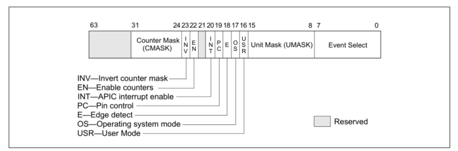
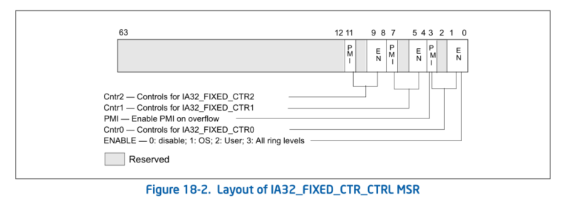

### 发展与概述

奔腾处理器开始有了性能监测的功能，引入了一些特定于微架构的性能计数器**MSR**。intel P6系列处理器的性能监测机制增强；接下来Intel processors based on Intel NetBurst microarchitecture引入了分布式性能监测机制和性能事件。

奔腾，P6家族和基于NetBurst微架构的处理器的性能监测机制和时间是非体系结构(not architectural)，都是基于微架构的。

后面的Intel Core Solo and Intel Core Duo processors支持非架构事件和一些架构性能事件。

而发展到现在，新一代intel处理器支持增强的架构性能时间和微架构性能事件。

其实从Intel Core Solo 和 Intel Core Duo processors开始，就两类的性能监测的功能。第一类是微架构事件，且不能使用cpuid查看，但可以通过 <https://perfmon-events.intel.com/> 这个网站查看；另一类就是体系结构事件了，体系结构事件在不同实现的处理器的表现是一样的，而且可以由cpuid查看。

### 体系结构性能监测版本

参考intel开发手册-卷3-18.2

有5个版本，不同微架构版本不同，可以用cpuid指令查看

### 常识介绍

CPL：current privilege level

APIC：Advanced Programmable Interrupt Controller 参考 intel软件开发手册-卷3-10

### 1.1 版本1

IA32_PMCx MSRs 和  IA32_PERFEVTSELx MSRs ，一个是性能计数器，一个是性能时间选择寄存器。IA32_PMCx MSRs从地址**186H**开始，占用一个连续的MSR地址空间块。IA32_PERFEVTSELx MSRs也一样，从**0C1H**开始占用一个连续的MSR地址空间块。

讲一下Layout of IA32_PERFEVTSELx MSRs的结构：

各个域的描述：

1. event select field：选择一个体系结构时间

2. unit mask：
   These bits qualify the condition that the selected event logic unit detects. 这些位限定了所选事件的条件逻辑单元检测。不是很懂，但反正就是event select field确定，unit mask也就确定了

3. USR (user mode) flag (bit 16)：权限有4个ring，这个设置与否，决定对应性能计数器寄存器是否在非0ring情况计数

4. e (edge detect) flag (bit 18)：
   原话：This mechanism allows software to measure not only the fraction of time spent in a particular state, but also the average length of time spent in such a state (for example, the time spent waiting for an interrupt to be serviced). 这种机制使得软件不仅可以测量在某一特定状态下所花费的时间的百分比，而且还可以测量在这种状态下花费的平均时间(例如，等待中断的时间服务)。不太懂，略过吧

5. PC (pin control) flag (bit 19)

   从Sandy Bridge开始，这个位被保留，之前的微架构有用

6. INT (APIC interrupt enable) flag (bit 20) ：When set, the logical processor generates an exception
   through its local APIC on counter overflow.这个原话不太懂，好像是什么会触发异常

7. EN (Enable Counters) Flag (bit 22)：不太懂

8. Counter mask (CMASK) field (bits 24 through 31)

   原话翻译：

   “当该字段不为零时，逻辑处理器将此掩码与单个周期内检测到的微架构条件的事件计数进行比较。”

   这句话不懂

8.和7.域应该是关联的

### 1.2 版本2

在体系结构的性能监测上，增加了几个固定功能的计数器寄存器和对应控制寄存器。IA32_FIXED_CTR0-2，三个，以及对应的控制寄存器：IA32_FIXED_CTR_CTRL。IA32_FIXED_CTR_CTRL不像IA32_PERFEVTSELx，不需要UMASK

为了简化编程，提供了下面三个寄存器：

1. IA32_PERF_GLOBAL_CTRL：allows software to enable/disable event counting of all or any combination of fixed-function PMCs (IA32_FIXED_CTRx) or any general-purpose PMCs via a single WRMSR.只通过WRMSR指令，令固定功能寄存器或者通用功能寄存器停下来
2. IA32_PERF_GLOBAL_STATUS
3. IA32_PERF_GLOBAL_OVF_CTRL

来看一下`IA32_FIXED_CTR_CTRL MSR`寄存器的结构：

他能控制三个特定功能计数器单元，每一个计数器单元有4个bit控制，4bit中有两个控制域：分别为Enable field和PMI field ，第2位作为保留位。

这里我就介绍Enable field：

第1个bit是控制开关的，第0个bit是决定计数器是否在非ring0权限下还计数

该寄存器的地址为：0x38d

参考了intel软件开发手册-卷3-18.2.2

### 疑问

一模一样的IA32_PERFEVTSELx MSR为什么要有4个？
这些IA32_PERFEVTSELx MSR的结构确实都是一样的，x从0开始，最高到3，有4个。参考 intel软件开发手册-卷4
这个寄存器的layout如下：

0-7选择事件，有8个体系结构事件。对啊，那我只有一个IA32_PERFEVTSELx MSR寄存器，任意选一个，然后再读取对应的计数器寄存器不就行了。但是你想想你同时拥有这么多寄存器的话，你不就可以同时测量这么多个性能参数了吗？

### 使用方法

1. msrtools

   通过下载该工具，来读和写msr，使用前需要使用`sudo modprobe msr`命令载入`msr`内核

2. msrtools的命令

   例如：`wrmsr -p 0 0x186    0x4100c0`还有`rdmsr`命令来读

### non-architectural 事件

Intel Core i7 processor family使用IA32_PERFEVTSELx MSR来配置non-architecture performance monitoring events

参考 参考了intel软件开发手册-卷3-18.3.1
