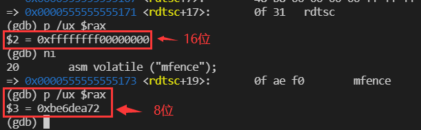
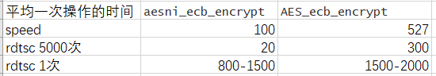
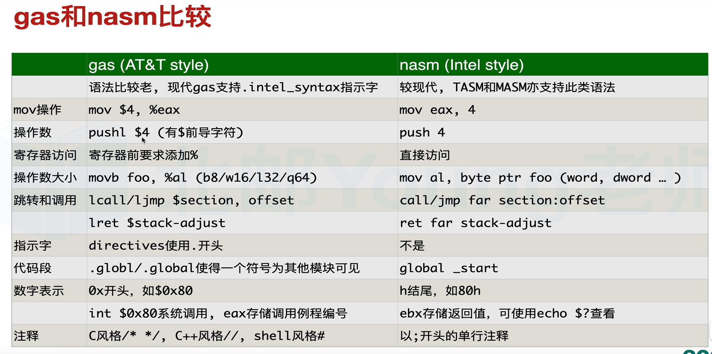
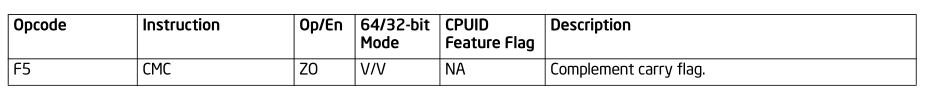
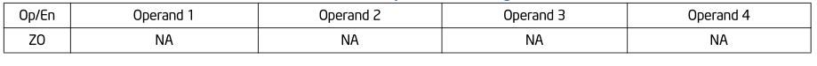
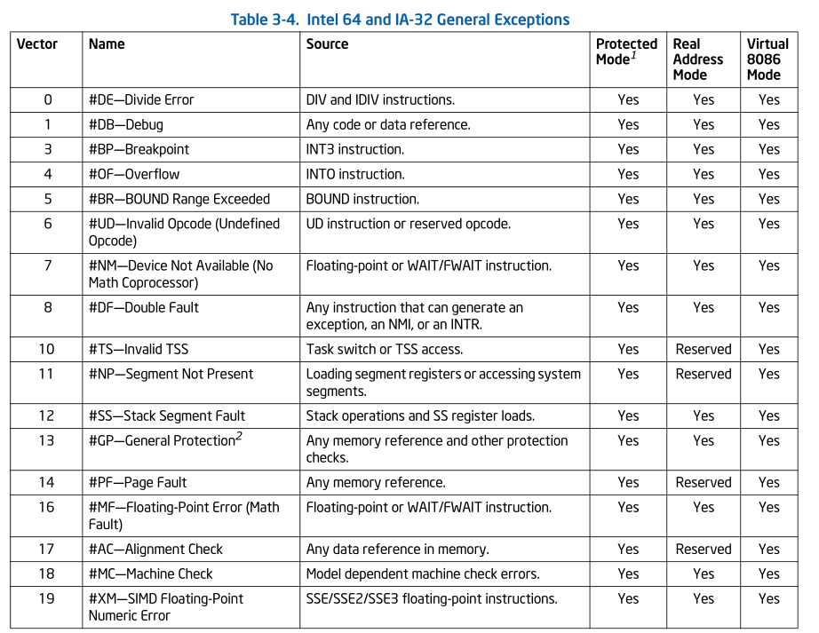
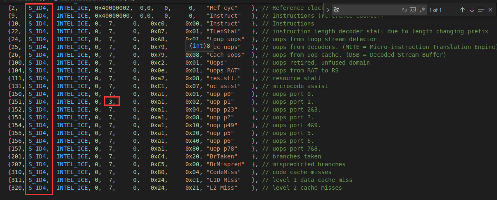

## 1 常识及新知识

1. 编译器的优化不会对汇编代码进行优化，编译器对代码的优化会间接影响指令在微体系结构层面的表现。
2. 查看编译器优化后代码变化的方法：

- 使用`objdump -d app` ，objdump 的其他选项；-t 显示符号表内容，-d 显示文本段内容，-D 显示全部段内容，-s 指明显指定段的所有内容

- 使用 gcc 的`-S`选项生成汇编代码文件，如`gcc -S -O3 t1.c`
- 通过 gdb 调试，并开启`set disassemble-next-line on`

### 1.1 内联汇编

参考 v <https://www.bilibili.com/video/BV1344y1m7qU>

内联汇编的高级用法应该是只有 AT&T 的风格

### 1.2 linux 内核模块编写

参考 v <https://www.bilibili.com/video/BV1qC4y1a7W5?p=2>

### 1.4 内存屏障与串行化指令

参考：Intel® 64 and IA-32 Architectures Software Developer’s Manual Volume 3 (3A, 3B, 3C & 3D): System Programming Guide-8.3 SERIALIZING INSTRUCTIONS，8.2.5 Strengthening or Weakening the Memory-Ordering Model

参考：<https://blog.csdn.net/qq_43401808/article/details/86473082>

串行化指令的概念非常容易理解，但是要用好（在哪里用，何时用）则需要深厚的处理器架构和流水线乱序执行的功底。好在大部分应用程序不会用到这类指令。

需要使用串行化指令的例子：

1. 使用 rdtsc 测量一段代码的运行时间时，为了精确测量需要
2. 其他性能测量指令也是一样，需要序列化指令的辅助

fence 系列指令是访存排序指令，并不是串行化指令。这些指令会“清空”存储器子系统（即将数据全部刷回存储器）。他们不会串行化指令执行流。LFENCE 指令的确提供了一些指令顺序方面的保障。LFENCE 执行之前，所有先前的指令都要本地执行完毕；LFENCE 执行时，后续指令不会开始执行，但是取指，译码不受影响，此点与真正的串行化指令有所不同。

#### 1.4.1 fence 系列指令

- sfence：在程序指令流中序列化所有发生在 sfence 指令之前的 store(write)操作，但不会影响 load 操作
- lfence：在程序指令流中序列化所有发生在 lfence 指令之前的 load(read)操作，但不会影响 store 操作
- mfence：在程序指令流中序列化所有 load 和 store 操作

fence 系列指令在控制内存序列化方便比 cpuid 更高效，说的应该是性能比较高

#### 1.4.2 串行指令

下面的指令属于串行化指令：

- 特权串行化指令 – INVD，INVEPT，INVLPG，LGDT，LIDT，LTR，MOV（to control register，with the exception of MOV CR8）(**操作 CR8 寄存器时**)，MOV（to debug registger），WBINVD 以及 WRMSR（WRMSR to IA32_TSC_DEADLINE (0x6E0H)和 x2APIC MSR (0x802H~0x83FH)不是串行化操作）(**可以看到 RDMSR 指令没有被列出**)
- 非特权串行化指令 – CPUID，IRET 和 RSM

当处理器将指令执行串行化时，它确保所有的进行中的访存事务全部完成（包括写存缓冲区中存储的写操作），然后才会执行下一条指令。任何指令都不能跨越串行化指令，串行化指令也不能跨越任何其他指令（读，写，取指，或者 I/O）。例如 CPUID 指令可以在任何权限级别使用，用于串行化指令执行，不干扰程序流，唯一的影响是 EAX/EBX/ECX/EDX 寄存器会被修改。

### 1.5 cpu 频率与几种时间

1. 最高睿频和 CPU 主频
2. elapsed time 和 cpu time
   CPU Time 指的是 CPU 在忙于执行当前任务的时间，其并没有考虑等待时间，如 IO 等待，网络等待等，而 Elapsed Time 则是执行当前任务所花费的总时间，

## 编译器优化细节与举例

### 1.3 -O3 与向量化

不同操作系统的 gcc 优化选项产生的结果会不同，**mac 和 linux**的`-O3 -S`选项产生的汇编文件就不一样。**在 linux 下使用**-O3 将代码向量化时要注意，有些代码能够被向量化，有些代码则不能，如：

```c
int sum_simple(int* vec)
{
   int res = 0;
   int i;
   for (i = 0; i < 500; ++i) {
      res += vec[i];
   }
   return res;
}
//可以被向量化
```

```c
int sum_simple(int* vec, int count)
{
  int res = 0;
  int i;
  for (i = 0; i < count; ++i) {
    res += vec[i];
  }
  return res;
}
//不可以，与上面的区别就是i的循环上限是count，这是个变量
```

上面的两个代码，一个能够被向量化，一个则不能，因为第二个代码编译器会考虑 count 小于 4 的情况，如果循环只执行少于 4 次，那么凑不够一次向量加需要 4 个整数的条件。

## 2 实战

### 2.3 指令串行化与 rdtsc 指令

前提，该实验的数据需要定义在函数中，不然 clflush 和 prefetch 会失效

结果：

1. `clflush`与`prefetch`指令之间需要加`mfence`，不然会乱序
2. `mfence`有开销，大概几十个时钟周期，`cpuid`开销为上千个时钟周期；所以不管乱序不乱序都会有误差，
   解决：可以用有指令时测量的时间-无指令时测量的时间，但该方法需要取平均值
3. 除了测量时间需要考虑`mfence`和`cpuid`等辅助指令开销对测量时间结果的影响，cpuid 是真正的指令序列化，fence 系列指令只是内存操作的序列化
4. c 语言的数据尽量写在函数内，写在函数外的话，编译器优化可能会出错；函数的定义只能写在 main 函数外

### 2.1 C++分支优化

1. `cmp`问题

`cmp r1, r2`是 r1-r2，但是注意**AT&T 风格**的话`cmp %r1, %r2`，那就是 r2-r1

### 2.2 rdtsc, or, 寄存器高位清零

1. 目的：

   - 探究：rdtsc 使用后，相关寄存器 rax 与 rdx 是否会清零。

   - 为何要探究：我写的 rdtsc 代码在 gcc 编译后的汇编代码中有`or`指令，`or`在这里的功能是`rax = (rdx<<32)+rax`中的`+`，但是 rax 的高 32 位必须都是 0，因为如果不全是 0，那么`rax = (rdx<<32)+rax`这个运算的结果`rax`的高 32 位就不是`(rdx<<32)`

2. 实验步骤：

   使用如下代码验证：

   ```asm
   mfence
   movabs $0xffffffff00000000,%rax ;movabs在这里与mov指令用法无异
   rdtsc
   mfence
   shl    $0x20,%rdx
   or     %rdx,%rax
   ```

   line2 给 rax 寄存器高 32 位赋值全 1，那么 rdtsc 如果不将 rax 高 32 位清 0，那么 line6 执行后，rax 就得不到正确结果

3. 结果：

   通过`gdb`发现，`rdtsc`指令后，rax 高 32 位被清零，rax 最终结果就会是`(rdx<<32)+rax`



### 2.4 cpuid 与 rdtsc 冲突

### 2.5 短时间测量和长时间测量的误差

`openssl`的`openssl speed aes-128-cbc`调用的是`AES_ecb_encrypt`函数，使用`speed`子命令折算下来的处理一个 16byte 需要 527 个时钟周期(使用 3.8ghz)计算，而使用 rdtsc 小范围测量 5000 次，只要 300 左右时钟周期，测量一次的话，一次 1500-2000 时钟周期这个样子。对于`aesni_ecb_encrypt`，单次测量 800-1500；测 5000 次，22 周期；openssl 的 speed 命令为 100 时钟周期



## 汇编基本知识

rv <https://www.bilibili.com/video/BV1gC4y1b7y8>

r intel 官方手册 Intel® 64 and IA-32 Architectures Software Developer’s Manual Volume 2 (2A, 2B, 2C & 2D): Instruction Set Reference, A-Z k1 第三章开始可以查看 Intel 所有指令的说明与用法

### 1 寄存器操作符

下面是扩展的寄存器操作符：

**32 位：**

x87 FPU 寄存器(ST0-ST7) 浮点操作数
mmx 寄存器 (mm0-mm7)
xmm 寄存器(xmm0-xmm7,mxcsr)
control 寄存器(cr0,cr2,cr3,cr4,gdtr,ldtr,idtr,...)
debug 寄存器(dr0,dr1,dr2,dr3,dr6,dr7)
msr 寄存器
**64 位的新变化：**
rdx:rax 对，表示 128 位操作数

### 2 参数传递

1. 在函数调用前，将参入放入各个寄存器中，然后再调用函数
2. 参数列表：参数是个地址，例子：比如传入参数是字符串这种很长的数据
3. 通过栈，规范但性能不如直接用通用功能寄存器

### 3 保存过程状态信息

过程调用时，处理器不会自动保存状态，过程调用函数需要显示完成状态保存，可将需要保存的寄存器存储至栈或者某个数据段中。调用过程**如果要保存 EFLAGS 寄存器状态**，可以使用**PUSHF**(lower word of eflags)/**pushfd**(entire eflags register)保存，**popf/popfd**恢复

### 4 保护级别

系统内部设置了名为 gate 的严格控制的接口，低级别代码访问高级别代码时，需要经过 gate 验证，

不同 level 之间代码调用时发生了什么？

1. call gate descriptor 的使用，其中包括如下信息
   权限访问信息
   调用过程的代码执行点(CS+IP)
2. 不同栈之间的切换，每个级别都有自己的栈，各个栈的信息都存储于 TSS (task state segment)

不同级别之间的 call 和 ret 操作？
**CALL**
·权限检测
·(内部)临时存储 SS ESP CS EIP
.从 TSS 加载 SS 和 SP for the new stack(另一级别)并切换至新栈。将 SS 和 SP 的值压入新栈
·将参数从调用栈拷贝至新栈(call gate 中的值确定参数个数)·将调用进程的 CS 和 EIP 压入新栈
·从 call gate 中加载新代码段 CS 和新指令指针 EIP·在新级别中开始执行
**RET**
·权限检测
·恢复 CS 和 EIP 的值
·根据 RET n 的参数 n 的值，修改堆栈指针
·恢复 SS 和 ESP 到调用前的值，并切换到调用前的栈
·根据 RET n 可选的参数 n 值，调整堆栈指针·接续调用进程的执行

### 5 Interrupts&Exception

处理器提供两种打断程序执行的机制
Interrupt：异步事件，典型情形为由 I/O 设备除法
Exception：同步事件，由处理器检测到一个或者多个预先定义过的条件时产生，IA-32 架构具体声明了三种异常：分别是 faults，traps 和 aborts
处理器采用同样的方式处理 interrupts 和 exception，均为暂停当前程序运行，并切换到相应的处理例程(handler)执行，处理器通过 IDT(interrupt descriptor table)查找处理例程，执行完毕后，在回到被中断的程序继续执行
IA-32 架构预定义了 18 种中断和异常，并预留了 224 个终端信号给用户自定义使用，每个 IDT 表中的每个终端和异常均由一个数字标识，叫做 vector
**调用执行过程：**

1. 无栈切换(相同级别)
   - 将 EFLAGS,cs,eip 依次压栈
   - 将错误代码压栈
   - 根据需要，从 interrupt gate 或者 trap gate 中加载新代码段和新指令指针的数值到 cs 和 EIP 寄存器
   - 省略
   - 开始执行处理例程
2. 有栈切换-更多寄存器压栈，栈切换

**返回执行过程：**

- 调用执行过程的反过程

### 6 几个例子

1. cpuid 的使用

   r <https://blog.csdn.net/swanabin/article/details/20050545> k CPUID 指令的使用

2. linux 下关于两种汇编风格的切换

- objdump 工具：`objdump -Mintel -d t2_1.o` 此命令反汇编后显示的是 intel 风格的汇编
- gdb：`set disassembly-flavor intel` `set disassembly-flavor att` 设置后 `disassemble` `ni` `si`命令就会显示不同的汇编语言风格，更多 gdb 命令请见 “gdb 各种指令介绍”

### 7 汇编中的宏

### 8 x64 参数传递规则

参考：<https://blog.csdn.net/weixin_36078737/article/details/116889971>
当参数少于 7 个时， 参数从左到右放入寄存器: rdi, rsi, rdx, rcx, r8, r9。

### 32 位函数调用参数传递规则

1. 栈传递的两种形式，cdecl 与 stdcall

   (1) cdecl 参数压栈顺序，从右到左，调用后在函数用 add esp, xxx 平衡 (清理) 栈

   (2) stdcall 参数压栈顺序，从右到左，调用的函数自己在 ret 时平衡栈，在函数结尾添加 retn 0x0c 进行平衡

   (3) windows 上的寄存器传递参数的形式：FASTCALL

   第一个参数用 ecx 第二个用 edx，其余参数还是通过堆栈传递（从右到左）。

```asm
Push x3
mov edx, x2
mov ecx, x1
Call function
```

### 9 使用.byte 写汇编

```asm
.byte 102,15,56,221,209
```

有些汇编代码会出现上面的内容，这表明该内容是一条指令，而不是数据，这条指令是`aesenc %xmm1,%xmm2`
参考：`/home/tam/Desktop/myopenssl/openssl/crypto/aes/aesni-x86_64.s`

### 相关参考资料

r <https://zhuanlan.zhihu.com/p/94649418> k1 epi8/epi16/epi32/epi64(讲了这些 avx2 内置函数的命名规则，用的时候要加上`immintrin.h`这个头文件)

## 环境搭建

1. ubuntu20.04
2. 调试器 gdb，另有插件：pwndbg
3. nasm 汇编语言编译器(可选)
4. `sudo apt install gcc-multilib`(多版本 c 语言库，**为了生成 32/64 位不同版本的可执行文件**)

### 1 两种风格的 x86 汇编比较


使用 gcc 将两种汇编格式相互转换

1. gcc 生成 intel 风格的汇编
   `gcc -S -masm=intel 01-hello.c -mavx2`

### 2 框架书写

### 3 入口函数

两种入口函数：main(c 语言标准库调用它)与 start

1. main：不同操作系统入口函数 main 的名字略有不同，mac 下关键字为`_main`，linux 下关键字为`main`

### 4 各种工具 转成 intel 风格的汇编

1. `objdump -M intel -d app`
2. `gcc -S -masm=intel 01-hello.c -mavx2`

### 5 gdb 各种指令介绍

1. 汇编级调试设置：`set disassemble-next-line on` 不设置就不会有对应的汇编代码

#### 5.1 格式化输出

- p 命令：打印变量，可格式输出

  格式化输出规则如下：

  x 按十六进制格式显示变量。
  d 按十进制格式显示变量。
  u 按十六进制格式显示无符号整型。
  o 按八进制格式显示变量。
  t 按二进制格式显示变量。
  a 按十六进制格式显示变量。
  c 按字符格式显示变量。
  f 按浮点数格式显示变量。

  eg：`p /x $rax` 16 进制显示，`p/ux $rax` 也是 16 进制显示

- x 命令：打印地址，可格式化输出，还能加减地址，例如 `x /uxg $rbp-0x10`

  格式化输出使用`h x`命令查看

#### 5.2 set 改变变量的值

`set {char*}key=0x572c6f6c6c654861`

### 6 gcc 工具使用

1. 性能优化选项：

   - gcc 不止`-O1, -O2`等优化选项，还有很多，参考<https://www.cnblogs.com/luolizhi/p/5737091.html> k1 `-O ' turns on the following optimization flags (里面提到-O 与-O1 等价，-O 选项相当于开启了-ftree-ccp，-ftree-ch 等等优化选项)
   - 循环展开优化选项：`-funroll-loops`
   - gcc -O3 会自动打开 -ftree-vectorize 选项。关闭向量化的选项是-fno-tree-vectorize

2. 指定指令集：

   `-mavx2`必须加这个选项才能使用 avx2 指令集

3. 查看 gcc 的所有优化选项

`gcc --help=optimize`

### 7 宏

## 5 性能优化常识

### 5.1 硬件事件

**core/offcore/uncore：** r1 <https://blog.csdn.net/weixin_34301307/article/details/89719954> r1 <https://developer.aliyun.com/article/590518?spm=a2c6h.13262185.0.0.61ac4355d2hopK> k1 PERF EVENT 硬件篇

cpu 内部元件是分层次构成的，所以性能事件根据此来进行划分成 core/offcore/uncore 事件

1. core

   core 即是在系统中查看 /proc/cpuinfo 看到的最小核（逻辑核）

   core 事件是最好理解的，即是跟逻辑核完全绑定的事件，如该核运行的 cycle 和 instruction 次数

2. offcore

   在 cpu 硬件实现上又分逻辑核和物理核，逻辑核即是物理核上进行超线程技术虚拟出来的两个核，实际上他们有一部分资源是共享的，而这部分资源被划分到 offcore

   offcore 事件稍微抽象点，它是由两个（或者多个兄弟逻辑核）共享的一些事件，比如访问内存，因为在硬件上它们走的是同一个通道。本质上，它是一个 core 事件，但需要额外配置。

3. uncore
   在物理核的层面上又有一部分资源是物理核共享的（同时也就是 cpu socket 的概念），比如 LLC 是一个 socket 共享，这部分资源被划分为 uncore。

uncore 较为复杂，它不在是以 core 为视角采集性能事件，而是通过在共享资源如 LLC 的视角对接每个 core 设备时提供各式各样的 Box。再拿 LLC 举例子，LLC 提供若干 CBox 为每个 core 提供服务。因此 uncore 事件要建立在 CBox 元件上。

硬件事件的相关参考资料：

1. Intel 官方手册：Intel® 64 and IA-32 Architectures Optimization Reference Manual 的附录 B USING PERFORMANCE MONITORING EVENTS；Intel® 64 and IA-32 Architectures Software Developer’s Manual Volume 3 (3A, 3B, 3C & 3D): System Programming Guide 的 Chapter18 PERFORMANCE MONITORING
2. `perf list` 可以查看支持的硬件事件
3. <https://download.01.org/> 下载各个微架构的硬件事件，<https://perfmon-events.intel.com/> 查看各个微架构具体的硬件事件

### 5.2 精准测量

如何精准测量？答：对想要测试的代码重复运行多次来提高准确性：

r `testp/testp.pdf` k 7.22 How accurate are the counts?

使用`rept`宏，`masm` 语法如下(`nasm`相似，但写法还是不同)：

```asm
REPT 100
  SHR  EAX, 5
ENDM
```

这样就会产生 100 次`shr`的代码，5 这个数字不用改，不会影响测试结果，但是这样会超过 code cache 的大小

- 想在不超过代码缓存大小的情况下获得更高的计数

使用如下语法(masm 语法，其他汇编器写法不同)：

```asm
MOV ECX, 10000
ALIGN 16
L:
  REPT 100
    SHR  EAX, 5
  ENDM

  DEC  ECX
  JNZ  L
```

### 5.3 吞吐量和延迟的测量

1. latency(延迟)

   ```asm
   MULPS XMM0, XMM1
   MULPS XMM1, XMM0
   MULPS XMM0, XMM1
   MULPS XMM1, XMM0
   ```

   我们可以看到，10 万条指令需要 50 万个时钟。因此，该指令的延迟为 5 个时钟。

2. 吞吐量

   吞吐量测量是用指令序列进行的，其中每个指令不必等待前一个指令完成：

   ```asm
   MULPS XMM1, XMM0
   MULPS XMM2, XMM0
   MULPS XMM3, XMM0
   MULPS XMM4, XMM0
   ```

### 5.5 Intel 手册的指令格式

参考 Chapter 3, “Instruction Set Reference, A-L, ” in the Intel® 64 and IA-32 Architectures Software Developer’s Manual, Volume 2A
以`cmc`指令为例：



opcode 列说明：

指令列说明：

operation encoding Op/En 列说明：

64/32-bit Mode 列说明：

- V - 支持

- I - 不支持

- N.E. - 说明指令不会在 64bit 模式下编码，it may represent part of a sequence of valid instructions in other modes，这句英文不知道啥意思

- N.P - 说明 REX prefix 不会在 64bit 模式下影响普通指令

顺带一提`Compatibility/Legacy Mode`也在 3.1.1.5 这个部分，有些指令有`Compatibility/Legacy Mode`这一列，但是没有`64/32-bit Mode`这一列。

cpuid 特性 flag 列说明：

exception 部分：

`cmc`的指令操作数编码：



保护模式下异常：



### 5.8 msr 与 pmu

关于 msr 寄存器，有两个相关指令 rdmsr/wrmsr

1. Linux 读写 CPU MSR 寄存器命令 rdmsr/wrmsr r <http://ilinuxkernel.com/?p=255> (介绍不编程也能读取 msr 寄存器的工具，注意：使用前需要使用`sudo modprobe msr`命令) rv <https://www.bilibili.com/video/BV1nX4y1N7xT> 注：pmu 单元是获取 CPU 各个性能参数的性能计数单元，通过对 msr 寄存器获取各个性能事件

参考 intel 开发手册卷 3-18 章

#### 相关术语

CPL：current privilege level

#### 问题描述

测量的指令数基本是不变的，但时间变化幅度有些大，因为有些时候会发生中断

## testp

这是一个大佬用的测量程序性能的工具，忘了怎么用它，就看这个文件夹中的`testp.pdf`，都是这么过来的

是一个测试程序，但是在我的电脑跑不了，无法获取其他的性能计数器，修改了这个文件`testp/PMCTest/PMCTestA.cpp`

### 1 PMCTest 文件夹

### 2 TestScripts 文件夹

1. 各种指令集的测试用例，*.sh1 是测试各个指令集延迟和吞吐量结果存放在 result1 文件夹，*sh2 是测试指令集其他方面的脚本文件结果存放在 result2 文件夹
2. 要运行*.sh1 和*.sh2，需要先运行./init64 脚本，但是脚本生成的`x`可执行文件会发生段错误，需要修改 PMCTestA.cpp：
   MScheme，MFamily 两个变量接受当前电脑的参数，然后与文件中事先定义的数据进行匹配，但是我的电脑没法匹配已有的，我只能修改：



在 id 对应"151"对应的行中，因为原数据对应电脑型号的这一行不兼容，除了要将 S_ID5 修改成 S_ID4，还需要修改图中标红方框的那一项

详细见 testp.pdf 的第五部分"5 Test scripts"

## 7 实战中代码及工具

1. `global main`的汇编源代码的编译：

```makefile
hello: hello.o
 gcc -no-pie hello.o -o hello

hello.o: hello.asm
 nasm -felf32 hello.asm
```

### 7.1 `__attribute__`

1. aligned

   例子：`int __attribute__ ((aligned (64))) arry[1024][16]={0};`这样元素由 4 字节变成了 64 字节的占用

2. 取消优化

   ```c
   asm volatile("": :"r,m"(a): "memory");
   ```

### 7.2 各种汇编模板代码

按风格分为 AT&T 和 Intel 风格，按入口按序分为 start 和 main 入口，再按 32 位和 64 位，所以不同编译器有 8 种汇编语法。很复杂，所以针对每个编译器我们只选择几种常见的语法

按照编译器分类：

#### gcc

1. ATT，main，32 位
2. ATT，main，64 位

#### nasm

1. intel，start，64 位

#### 其他

### 7.3 内联函数

1.`void _mm_prefetch(char *p, int i)` 函数
从地址 P 处预取尺寸为 cache line 大小的数据缓存，参数 i 指示预取方式（\_MM_HINT_T0,\_MM_HINT_T1, \_MM_HINT_T2,\_MM_HINT_NTA，分别表示不同的预取方式）
T0 预取数据到所有级别的缓存，包括 L0。
T1 预取数据到除 L0 外所有级别的缓存。
T2 预取数据到除 L0 和 L1 外所有级别的缓存。 2.`_mm_clflush (void const *__A)`
同时使用上面两个指令时需要用序列化指令间隔开来

### 7.4 低位传高位指令

`movzwl m3(%rip), %eax` 16(word)传向 32(long)
8086 汇编

## 微架构性能相关期刊和会议

中国计算机学会推荐国际学术会议中的“计算机体系结构/并行与分布计算/存储系统”类中。

### 1 uops.info 网站中的很多参考文献

[1] uops.info: Characterizing Latency, Throughput, and Port Usage of Instructions on Intel Microarchitectures 被 A 类会议 **ASPLOS** 收录

[2] nanoBench: A Low-Overhead Tool for Running Microbenchmarks on x86 Systems 被 C 类会议**ISPASS**收录

## 1.1 clflush 与 prefetch 的使用

实验中发现，clflush 与 prefetch 指令对全局变量无效，即数据要在栈中，这两个指令才会有效，我也不知道这是为什么。

而且`clflush`与`prefetch`指令之间需要加`mfence`，不然会乱序。

## 常识及容易困扰的点

1. c 语言的数据尽量写在函数内，写在函数外的话，编译器优化可能会出错；函数的定义只能写在 main 函数外

2. cpuid 是真正的指令序列化，fence 系列指令只是内存操作的序列化；

  `mfence`有开销，大概几十个时钟周期，`cpuid`开销为上千个时钟周期；所以不管乱序不乱序都会有误差，解决：可以用有指令时测量的时间-无指令时测量的时间，但该方法需要取平均值

## 参考资料

[1] 计算机组成与设计-硬件/软件接口

[2] 深入理解计算机系统，第五章优化程序性能

[3] 数字设计和计算机体系结构

[4] 现代处理器设计-超标量处理器基础，第六章 Intel P6 微体系结构

[5] intel 系列官方手册 <https://software.intel.com/content/www/us/en/develop/articles/intel-sdm.html>
