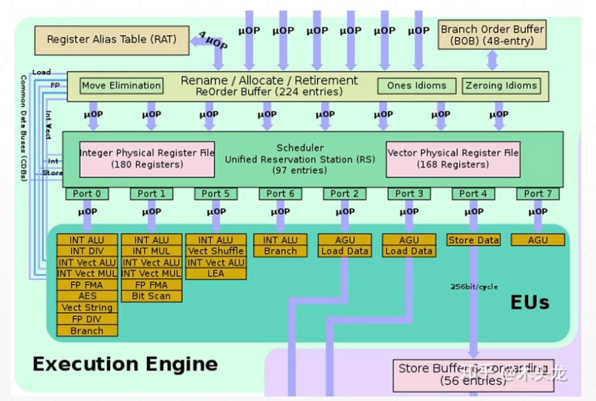

参考了acm IPCC的视频

## 1 cache优化

- 目标：提升cache命中率，以提高内存访问速度
- 指令cache
  - **减少跳转**(减少分支判断，减少函数调用，禁用go语句)可以加快指令cache的访问性能

- 数据cache

  - 数据预取
  - 行主映射与列主映射(C: 行主序，FORTRAN：列主序)

```c
int a[M][N];
int row_major(){
   for(int i=0;i<M;i++){
      for(int j=0;j<N;j++){
         //use a[i][j];
      }
   }
}
```

## 2 除法优化

使用乘倒数逻辑消去计算中的除法，可以有效地提升计算的性能



因为除法处理部件往往少于乘法部件，所以乘法指令往往比除法指令有更好的吞吐量

## 3 分支预测

使用编译器的内联函数来显示告诉编译器某一分支的概率，以辅助编译器进行代码优化

## 4 循环展开

- 进行多路循环展开，可以极大的减少分支预测次数
- 对于较短的计算内核，进行循环展开可以极好的提升指令流水并行性

```c
#define M 1000
int loop(){
   //...
   for(int i =0;i<M;i++){
      c[i]=a[i]+b[i];
   }
   //...
}
```

```c
#define N 4
int unroll_loop(){
   //...
   int i;
   for(i=0;i<M-(N-1);i+=N){
      c[i]=a[i]+b[i];
      c[i+1]=a[i+1]+b[i+1];
      c[i+2]=a[i+2]+b[i+2];
      c[i+3]=a[i+3]+b[i+3];
   }
   for(;i<M;i++){
      //将a,b数组中最后不足4个的元素加上
      c[i]=a[i]+b[i];
   }
   //...
}
```

## 5 向量化

循环展开后就可以向量化

## 6 数据对界

影响较小

## 7 内联函数

- 在编译期将函数**以复制的形式进行扩展**，取消调用开销
- 对于频繁调用的函数进行内联效果较显著
- 内联函数不应该太长
- 内联函数会使程序尺寸增大

## 8 数据预取

- 提前将可能用到的数据放入到Cache中，增加数据在Cache上的命中率
- 通常意义上的数据预取指提前取数据到cache内，但数据预取更重要的在思想，即保证在处理之前将数据准备好
- 一般应用于计算之前，预取需要的数据

## 9 优化等级

- O0：
- O1：
- O2：
- O3：较O2优化等级更高，包含更多更加激进的优化策略
- Ofast：除所有O3等级外，还包括损失精度的优化策略

### 9.1 详细优化选项

## 10 使用`__builtin_xxx及__attribute__`

## 11 内联汇编(不推荐)

- 学习成本高
- 内联汇编会严格按照程序员书写的汇编代码顺序，编译器无法进行汇编代码前后段指令依赖分析以进行乱序
